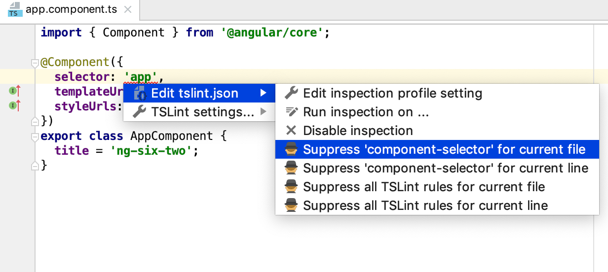
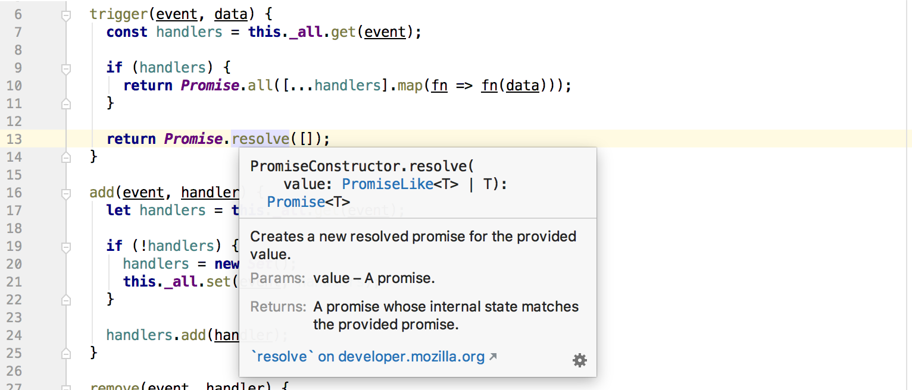

# New Features

<!--ts-->
   * [New Features](#new-features)
   * [2018.3](#20183)
      * [JavaScript &amp; TypeScript](#javascript--typescript)
         * [★ Autoimports in JavaScript](#-autoimports-in-javascript)
         * [★ Parameter hints](#-parameter-hints)
         * [Multi-line todos](#multi-line-todos)
         * [Override method](#override-method)
         * [★ Convert to variable with arrow function](#-convert-to-variable-with-arrow-function)
         * [Better 'null' and 'undefined' check](#better-null-and-undefined-check)
      * [Frameworks](#frameworks)
         * [Improved Angular support](#improved-angular-support)
         * [★ Node.js APIs](#-nodejs-apis)
         * [Vuetify support](#vuetify-support)
         * [React improvements](#react-improvements)
      * [HTML and Style Sheets](#html-and-style-sheets)
         * [Accessibility inspections for HTML](#accessibility-inspections-for-html)
         * [★ Move and extract ruleset](#-move-and-extract-ruleset)
         * [New CSS code style options](#new-css-code-style-options)
         * [★ Remove tags](#-remove-tags)
      * [Testing](#testing)
         * [Easier navigation for tests](#easier-navigation-for-tests)
      * [Tools](#tools)
         * [Support for Node.js worker threads](#support-for-nodejs-worker-threads)
         * [★ More flexibility with ESLint and TSLint](#-more-flexibility-with-eslint-and-tslint)
         * [Completion in package.json](#completion-in-packagejson)
         * [Run Protractor test](#run-protractor-test)
         * [★ Live Edit](#-live-edit)
      * [Version Control](#version-control)
         * [GitHub PRs](#github-prs)
         * [Git submodules](#git-submodules)
         * [Ignore whitespaces](#ignore-whitespaces)
         * [Better support for precommit hooks](#better-support-for-precommit-hooks)
      * [IDE](#ide)
         * [★ New search popup](#-new-search-popup)
         * [High-contrast theme](#high-contrast-theme)
         * [Plugin configuration](#plugin-configuration)
         * [Drag folder to open](#drag-folder-to-open)
   * [2018.2](#20182)
      * [JavaScript &amp; TypeScript](#javascript--typescript-1)
         * [New inspection tooltip](#new-inspection-tooltip)
         * [Find unused code](#find-unused-code)
         * [★ New intentions](#-new-intentions)
         * [TypeScript improvements](#typescript-improvements)
      * [Frameworks](#frameworks-1)
         * [★ Extract and convert React component](#-extract-and-convert-react-component)
         * [New integrations with Angular CLI](#new-integrations-with-angular-cli)
         * [★ Completion for events in Vue.js](#-completion-for-events-in-vuejs)
      * [Testing](#testing-1)
         * [Rerun failed tests](#rerun-failed-tests)
         * [Diff view for Jest snapshots](#diff-view-for-jest-snapshots)
      * [Tools](#tools-1)
         * [Support for Node.js on WSL](#support-for-nodejs-on-wsl)
         * [★ Reconnect Node.js debugger](#-reconnect-nodejs-debugger)
         * [Global file watchers](#global-file-watchers)
         * [Other improvements:](#other-improvements)
   * [2018.1](#20181)
      * [JavaScript &amp; TypeScript](#javascript--typescript-2)
         * [New documentation UI](#new-documentation-ui)
         * [TypeScript improvements](#typescript-improvements-1)
         * [★ Rename class and file together](#-rename-class-and-file-together)
      * [Code Style](#code-style)
         * [★ Reformat with Prettier](#-reformat-with-prettier)
      * [Frameworks](#frameworks-2)
         * [★ Create a new Vue project](#-create-a-new-vue-project)
         * [★ Extract a Vue component](#-extract-a-vue-component)
      * [Tools](#tools-2)
         * [Debugging React Native apps](#debugging-react-native-apps)
         * [Configuring package manager](#configuring-package-manager)
         * [New Node.js Debugger Console](#new-nodejs-debugger-console)
      * [Version Control](#version-control-1)
         * [Partial commits in Git](#partial-commits-in-git)
         * [More Git improvements](#more-git-improvements)
      * [Style sheets](#style-sheets)
         * [Completion and go to definition for classes](#completion-and-go-to-definition-for-classes)
         * [Other improvements:](#other-improvements-1)

<!-- Added by: Jnoodle, at:  -->

<!--te-->

# 2018.3

## JavaScript & TypeScript

### ★ Autoimports in JavaScript

In JavaScript files, WebStorm can now automatically add imports not only for symbols defined in your project, but also for symbols from the project’s dependencies. This works as long as the library has sources written as ES modules or a TypeScript type definition file.

### ★ Parameter hints

Parameter hints are now available in JavaScript files. They **show the names of parameters** in methods and functions and make your code easier to read.

### Multi-line todos

You can now **add multi-line Todo comments**: type `todo` or `fixme` and then add extra indents on the next lines to continue the todo.

### Override method

When you **override a method** from the parent class or interface and select it from the completion suggestions, the IDE automatically adds parameters, `super()` call, and the type info.

### ★ Convert to variable with arrow function

A new intention (*Alt-Enter*) helps convert a function to a **variable that holds an arrow function**, or a class method to a field.

### Better 'null' and 'undefined' check

WebStorm can now better **detect** situations when you will get a **TypeError** because a method is invoked on a value that is `undefined` or `null`, or it is passed to a function, or its property is used.

## Frameworks

### Improved Angular support

WebStorm is now much better at helping you edit **Angular templates**. Сode completion and Go to definition for variables, pipes and async pipes, as well as for the template reference variables are now much more accurate. In total, over **50 known issues** have been fixed in Angular and AngularJS support.

### ★ Node.js APIs

**Parameter info and documentation for Node.js APIs** are now more detailed because they use data from *node.d.ts*. Go to definition will still take you to the Node.js sources if you want to see the actual implementation of the methods.

### Vuetify support

WebStorm now provides **code completion for components from Vuetify** version 1.1 or above.

### React improvements

In React apps, code completion now suggests all component **lifecycle methods**. The **Unresolved variable inspection** will now warn you about the possibly undefined components.

## HTML and Style Sheets

### Accessibility inspections for HTML

To help you to write more **accessible HTML code**, WebStorm adds new inspections that are based on recommendations from the [Web Content Accessibility Guidelines](https://www.w3.org/WAI/standards-guidelines/wcag/) (WCAG). These inspections cover about a dozen techniques, and suggest helpful quick-fixes when you press *Alt-Enter*.

### ★ Move and extract ruleset

With the new **Extract ruleset** action, available when you press *Alt-Enter*, you can quickly extract CSS declarations from one ruleset to a new, more specific one.

And the **Move refactoring** helps you move the whole ruleset from one CSS, SCSS, Sass, Less, or Stylus file to another.

### New CSS code style options

The code style for CSS, SCSS, Sass, Less, and Stylus now has a configuration for the **use of blank lines**. Moreover, you can now **sort the CSS properties** inside blocks – alphabetically or in some custom order.

### ★ Remove tags

The **Unwrap/Remove** action for **HTML and JSX tags** (available via *Alt-Enter* or *Shift-Cmd-Backspace* / *Ctrl-Shift-Delete*) now automatically updates the indents.

## Testing

### Easier navigation for tests

The **Structure view** now **shows the names of tests** and suites in the file. Start typing the test name to filter the list, and quickly jump to the one you need in the file.

For failed tests, double-click the test name (or *Jump to Source*) in the test tool window to go to the failure line (if it’s specified in the stack trace).

## Tools

### Support for Node.js worker threads

WebStorm now provides **code completion** for the worker threads’ API and allows you to **debug workers** – use Node.js 10.12 or above and the `--experimental-worker` flag. You will know in what thread the breakpoint is hit. You can also switch between threads to see the call stack and variables.

### ★ More flexibility with ESLint and TSLint

WebStorm uses severity levels from the linter’s configuration file, both in the editor and when inspecting the code before the commit. Now, you can **override these severity levels in the IDE** and see all problems from the linter as errors or warnings.

For TSLint errors, press *Alt-Enter* and then the right arrow key to **add a comment to suppress the rule**.

### Completion in package.json

For the dependencies in a *package.json* file, WebStorm now provides **suggestions for the latest version**, as well as **previous ones**.

### Run Protractor test

Use the editor gutter icon next to a Protractor test to **run or debug a single test or suite**.

### ★ Live Edit

The Live Edit feature now works **without the Chrome extension**.

## Version Control

### GitHub PRs

You can now see all Pull Requests in your project on GitHub right in WebStorm. In the menu *VCS - Git*, select **View Pull Requests** to open a new tool window that shows the PR’s description, assignee, labels, and, of course, the changed files. From there, see the diff or create a new local branch.

### Git submodules

All the familiar features in the Git integration, such as update project, commit changes, view diff, and conflict resolution, now work with **Git submodules**.

### Ignore whitespaces

You can now **ignore or trim whitespaces while merging** – the configuration is available in the new drop-down on top of the *Merge Revisions for…* dialog. Whitespaces are also ignored by default when you use Annotate for a file.

### Better support for precommit hooks

The *Commit dialog* now correctly shows and handles changes made to files with the precommit hook (for example, when you’re using *lint-staged*).

## IDE

### ★ New search popup

The **unified search popup** makes it easier to search for classes, symbols, and files in the project. You can even use it to search for IDE settings and actions! Start with *Search Everywhere* (*Shift-Shift*) or any *Go to* action, and then press *Tab* to switch the search context.

### High-contrast theme

To make WebStorm more **accessible** to everyone, we’ve added a new high-contrast UI theme.

The IDE now allows line numbers, VCS annotations, breakpoints, and other gutter icons to be read by a screen reader. Learn more about screen reader support in the [documentation](https://www.jetbrains.com/help/webstorm/accessibility.html#screen_reader).

### Plugin configuration

The **redesigned Plugins page** in Preferences now shows featured and most popular plugins. You can search plugins by categories and sort them by downloads and ratings.

### Drag folder to open

**Drag a folder** with code to the IDE’s Welcome Screen from the file manager or the desktop to open it in WebStorm.

# 2018.2

## JavaScript & TypeScript

### New inspection tooltip

The new inspection tooltip now not only **shows the description** of an error or warning, but also the **best quick fix** for it.

Press *Alt-Shift-Enter* to apply it or press *Alt-Enter* to see a full list of the available automatic fixes that WebStorm offers there.

### Find unused code

With the new **Code Coverage** feature, you can **find any unused code** in your client-side app. Start a *JavaScript Debug* configuration with coverage in WebStorm, interact with your app in Chrome, and then stop the configuration. The report will show you **what and how much code was used** in each file and folder.

### ★ New intentions

To make you even more productive when working with **JavaScript** and **TypeScript**, WebStorm has a bunch of **new intentions** that are available when you press *Alt-Enter*. Here are just some of them: *Implement interface*, *Create derived class*, *Implement members of an interface or abstract class*, *Generate cases for 'switch'*, and *Iterate with 'for..of'*.

### TypeScript improvements

WebStorm now supports all the new language features that were added in the latest **TypeScript 2.9** and the upcoming **TypeScript 3.0** releases.

In addition to that, WebStorm now offers more quick fixes provided by the TypeScript language service itself, like *Annotate with type from JSDoc*.

## Frameworks

### ★ Extract and convert React component

Need to refactor your React component into two? Forget copy and paste: select the JSX code in the `render` method and use **Refactor - Extract Component**.

And with the new intentions, you can now **convert React class components into functional components** and back again.

### New integrations with Angular CLI

**Add features** to your app with the *New… | Angular Dependency…* action. The IDE will use the Angular CLI `ng add` command which installs the dependency and updates the app with a special installation script.

You can now also **generate the code** with the Angular schematics defined in libraries like `@angular/material` using the *New… | Angular Schematic…* action.

### ★ Completion for events in Vue.js

In Vue templates, WebStorm now provides **code completion for events**. Event names are suggested after `v-on:` or if you use the shorthand notation `@event`. There’s also code completion for **event modifiers**.

## Testing

### Rerun failed tests

When you run tests with **Karma**, **Jest**, or **Mocha** in WebStorm, you can now **rerun only the failed tests**, instead of running all the tests after you’ve made a fix.

### Diff view for Jest snapshots

If your **Jest** test has failed because of the mismatch in the snapshot, you can now see why using the familiar IDE **side-by-side diff view**.

It’s also now possible to quickly **jump from the test file to the related snapshot** by clicking on the new icon next to the test in the editor.

## Tools

### Support for Node.js on WSL

You can now use Node.js on Windows Subsystem for Linux to **run and debug your Node.js application** in WebStorm as well as for all other development tasks in the IDE, like running tests, using linters, and build tools.

### ★ Reconnect Node.js debugger

Thanks to the new *Reconnect automatically* option in the *Attach to Node.js/Chrome* debug configuration, it is now easier to **debug Node.js apps that use nodemon**. When the node process is reloaded after the change, you don’t need to restart the debugger yourself to continue debugging.

### Global file watchers

You can now **store the configured File Watchers in the IDE settings** and use them in different projects. Before, a File Watcher could only be configured for a specific project. With File Watchers you can automatically run a command-line tool when you change or save a file in the IDE.

### Other improvements:

- **New cleaner, simpler icons** on the IDE toolbar and tool windows ensure readability and reduce visual clutter.
- Run and debug your app, commit changes and update the project right from the **Touch Bar on MacBook**.
- A new collection of over 50 **code snippets for React development**.
- WebStorm now **indexes a new Angular project two times faster**, with no compromises affecting the quality of code completion and resolve.
- You can now add **custom templates for postfix completion** in the JavaScript and TypeScript files.
- With the new **Drop frame action in the JavaScript and Node.js debuggers**, you can re-enter a function if you missed a critical spot you would like to see again.
- Press *Alt-Enter* on a line with a breakpoint and see the **breakpoint-related actions in the list of intentions**.
- **Support for JSON5** is now available in the files with the *.json5* extension
- **JSON Schemas files** are now automatically **downloaded** from schemastore.org and applied to your files, based on the file name.
- You can be logged into **multiple GitHub accounts**.
- **New Browse Repository at Revision action** allows you to explore files in your project at any given revision without a checkout.

# 2018.1

## JavaScript & TypeScript

### New documentation UI

Meet the new, more **compact and lightweight documentation popup**!

It uses a more clear and consistent format to present the available information about the method’s parameters, their type and their return type in JavaScript and TypeScript. It also renders Markdown used in the JSDoc comments.

### TypeScript improvements

In addition to the support for the latest TypeScript 2.7 features, this update improves the **Implement Members** action and adds the new **Surround with type guard** quick-fix for unresolved properties.

WebStorm now also recognizes TypeScript configuration files with names other than *tsconfig.json*.

### ★ Rename class and file together

Now if you run *Refactor – Rename* for a class, WebStorm will also suggest **renaming the file** and its usages if it has the same name as the class.

And if you press *Alt-Enter* on the name of the class, interface or type, you will see a new intention that suggests renaming the file to this name.

## Code Style

### ★ Reformat with Prettier

With the new **Reformat with Prettier** action (*Alt-Shift-Cmd/Ctrl-P*), you can format the selected code, a file or a whole directory using [Prettier](https://prettier.io/).

Note that Prettier should be installed as your project dependency or globally on your machine.

## Frameworks

### ★ Create a new Vue project

You can now create **new Vue projects** in WebStorm using [Vue CLI](https://vuejs.org/v2/guide/installation.html#CLI).

Install it by running `npm install -g vue-cli`, then press *Create New Project – Vue.js* on the IDE’s Welcome screen, and answer questions about the template and tools that you want to use in your new project.

### ★ Extract a Vue component

**Create a new Vue component** from an existing one, without any copy and paste – select the part of the template and use *Refactor – Extract* or press *Alt-Enter* and select *Extract Vue Component*.

WebStorm will create a new single-file component, add an import for it, and pass all the data and methods to it with props.

## Tools

### Debugging React Native apps

With the **updated React Native configuration**, WebStorm now supports more run and debug scenarios: you can now separately configure how the bundler is started and also attach the debugger to an app that is already built and launched on a device.

Moreover, you can now debug apps that use [Expo](https://expo.io/) right in the IDE.

### Configuring package manager

It has been made easier to **configure package managers** in WebStorm – in the *Node.js and npm* preferences, you can select between **npm** and **Yarn** and then use it to install dependencies and run scripts.

And if you open a new project with *yarn.lock* file, WebStorm will use Yarn in it if it’s installed.

### New Node.js Debugger Console

Node.js debugger now has two console tabs – the **Console tab** that shows the output of the node process itself and the new **Debugger Console** where you can execute JavaScript, see the console.log messages, and jump to the location where `console.log` was called.

## Version Control

### Partial commits in Git

With the support for partial Git commits you can now **commit only selected changes** from the file. Use checkboxes in the diff view of the *Commit Changes* dialog to select chunks of code you want to commit.

You can also add changed lines of code to a **new changelist** using actions on the editor gutter and then commit the changelist.

### More Git improvements

In the commit details, you can now **click on the commit hash** to jump to this commit in the Log.

When you’re doing a rebase, there are now new **Abort Rebase**, **Continue Rebase**, and **Skip Commit** actions available in the Git Branches popup.

## Style sheets

### Completion and go to definition for classes

*Cmd/Ctrl-click* on the class name in HTML will now suggest navigating not only to its declaration in the compiled CSS file linked in this HTML file, but also to the Sass, SCSS or Less source.

In HTML, code completion will suggest classes and id from all style sheets if there are no matching symbols in the linked CSS file.

### Other improvements:

- If you're migrating to **webpack 4**, WebStorm can now check and provide completion for option names in the webpack configuration file.
- Similar to tests, you can now **run npm scripts** using icons right in the editor.
- When you **copy the HTML code to JSX files**, WebStorm will automatically **replace** `class` and on-event handlers with React-specific attributes.
- New inspection in *package.json* will warn you if an installed version of the package **doesn’t match the specified range**.
- Better code completion for **SVG properties** and values in CSS files.
- You can now **synchronize the IDE settings** across multiple machines using your JetBrains account.
- Support for the **ECMAScript proposals**: escape sequences in template strings, RegExp lookbehind assertions and named capture groups, and class fields.
- **Improved code completion** and go to definition for the **dynamic imports** with `import()`.

