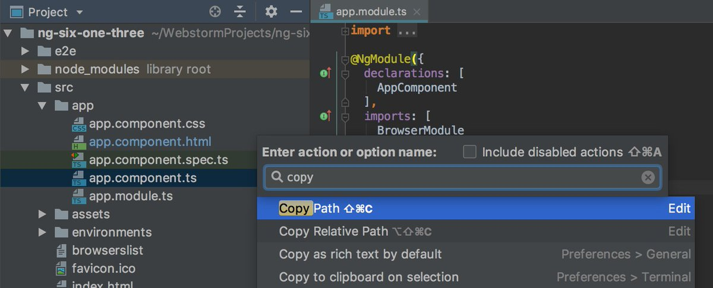
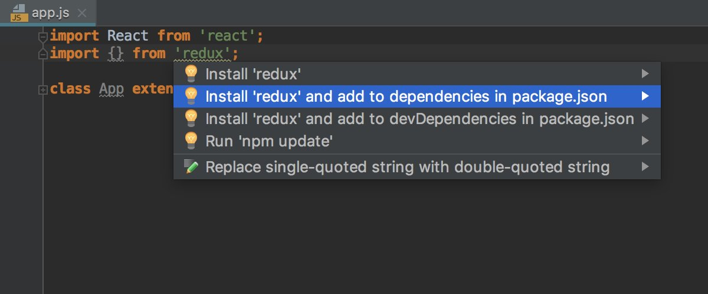
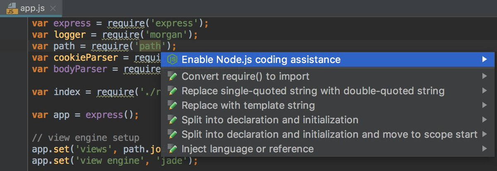
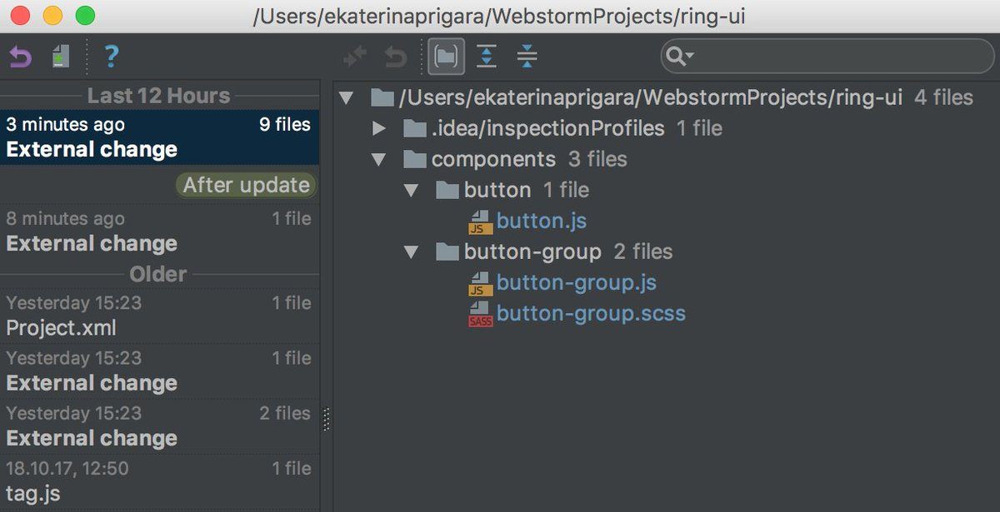
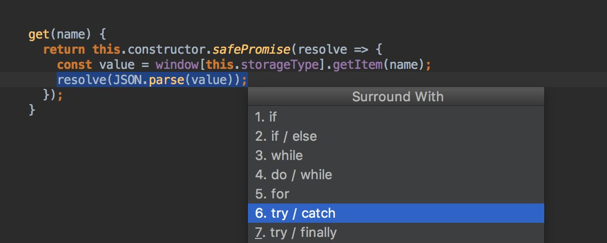
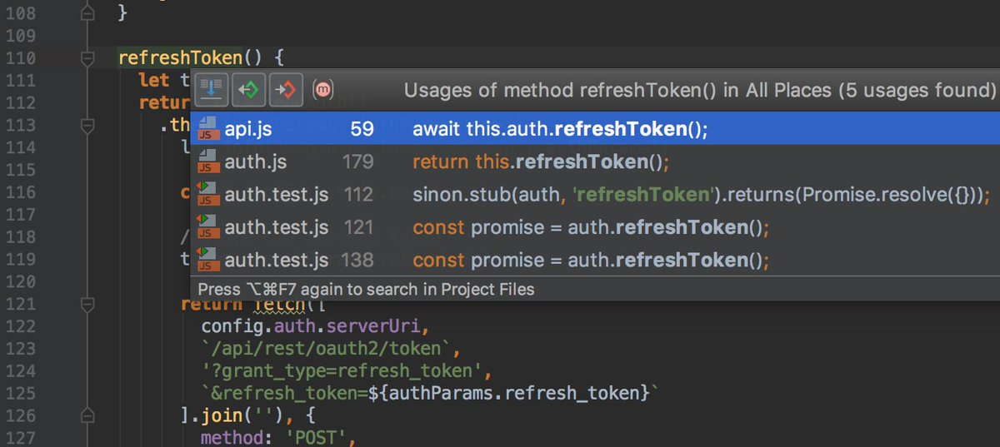
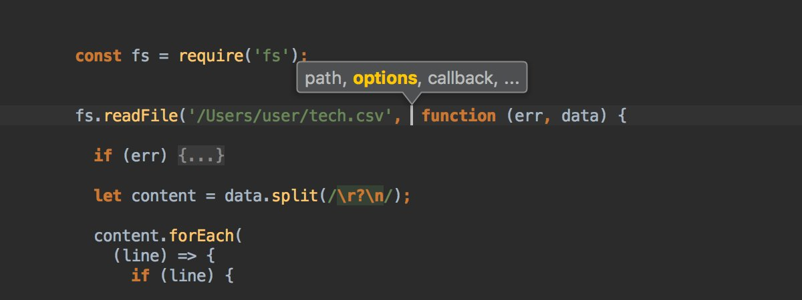

# Recommended Tips

[back to index](README.md)

<!-- Begin Feb 8  -->

Working with Vue.js? Convert chunks of code into Vue components easily with Alt+Enter which invokes WebStorm's Extract Component intention.

<video controls style="max-width:100%" src="assets/DyVC_pFWoAABq_m.mp4"></video>

Use Ctrl+J/Cmd-J. to launch WebStorm's Live Templates and zip through common HTML elements.

<video controls style="max-width:100%" src="assets/DyQItqlWsAAs-hO.mp4"></video>

A lot of time is spent moving code around to get it in the right place. Use Alt+Shift+Up/Alt+Shift+Down in WebStorm to move lines up or down.  It's much easier than copy and paste!

<video controls style="max-width:100%" src="assets/Dxce8xNX0AARe3v.mp4"></video>

Quickly add a `<script>` tag to an html page by dragging and dropping the script file onto the page.

<video controls style="max-width:100%" src="assets/DxH-wwcW0AADDB2.mp4"></video>

Need to remove a tag? Press Alt-Enter and select Remove tag.

<video controls style="max-width:100%" src="assets/DuUCGGhW4AEK6ie.mp4"></video>

Boost your productivity! Quickly switch between files or tool windows in WebStorm by pressing Alt+E.

<video controls style="max-width:100%" src="assets/Dtf5r0_XgAEpYId.mp4"></video>

The Surround With feature in WebStorm is a popular feature for developers who write HTML. Select the elements and press Alt+Enter to surround with the HTML you want.

<video controls style="max-width:100%" src="assets/DtLhFw0W0AUZkGa.mp4"></video>

You can quickly change the UI theme from dark to light or the over way around using the Quick Switch popup (Ctrl-`).

<video controls style="max-width:100%" src="assets/DrWFItSX0AAK2G4.mp4"></video>

To jump between style / html / typescript files of your #Angular component:

- use "Jump to Navigation Bar" shortcut (⌘+↑ or [alt]+[home]) 
- and press arrow down or start typing the extension

<video controls style="max-width:100%" src="assets/6eCYeba34eUpJUNV.mp4"></video>

Spotted a warning?

- Hover over it or press Cmd/Ctrl-F1 to see the description and the first quick-fix
- To apply the fix, click it or use Alt-Shift-Enter
- Press Alt-Enter to see all fixes and intentions

<video controls style="max-width:100%" src="assets/DnDirWnXgAApxfR.mp4"></video>

Press Shift-Cmd/Ctrl-C to copy a full path to the current file. And if you want a path from the project root, select file in the project view and press Alt-Shift-Cmd/Ctrl-C

In JSON configs WebStorm can auto-complete the properties, show descriptions for them and possible values.
Based on the file name, WebStorm picks a JSON Schema file from [http://schemastore.org/json/ ](https://t.co/tWKU0dJmsv), but you can select a different schema in the status bar.

<video controls style="max-width:100%" src="assets/DkuV0CRXgAA-BCy.mp4"></video>

With postfix completion you can add a snippet around an expression you’ve just typed.

<video controls style="max-width:100%" src="assets/DkFVBO_W4AAmGD-.mp4"></video>

Jump to the definition, see the usages or open a different file – you can always go back to the file and line where you’ve started using the Navigate Back action (Cmd-[ on macOS and Ctrl-Alt-Left on Windows and Linux)

<video controls style="max-width:100%" src="assets/DijhwgTWAAAl0XP.mp4"></video>

You can remove braces from the arrow function or add them with the quick fix - press Alt-Enter and choose the action you need.

<video controls style="max-width:100%" src="assets/DhrKG0iWsAAlKul.mp4"></video>

One of the ways to add a new dependency to your project is to add an import statement, then press Alt-Enter and select “Install and add to dependencies/devDependencies in package.json”

With Select All Occurrences (Ctrl-Cmd-G on macOS or Shift-Ctrl-Alt-J on Windows and Linux) you can edit all the occurrences of the current word or selected symbols in the file. Press Esc to remove selection.

<video controls style="max-width:100%" src="assets/Dc1wykAW0AEAP8X.mp4"></video>

Press Alt-Enter on `require('path')` or any other Node.js core module, to enable code completion for all Node.js methods.

Right-click on the project root and select Local History - Show History to see and revert the recent changes

Select the code, hit Alt-Cmd-T / Ctrl-Alt-T and select the statements you can quickly surround the code with.

With postfix templates you can quickly introduce variables: type .<var/let/const> and hit Tab to expand

<video controls style="max-width:100%" src="assets/DH1rWwpXcAEDutI.mp4"></video>

in JSX type / at the end of the Emmet abbreviation to expand it into a self-closing tag

<video controls style="max-width:100%" src="assets/DHXQOoLXkAIaS5G.mp4"></video>

Quickly see a list of usages with Show usages action – Alt-Cmd-F7 on macOS or Ctrl-Alt-F7 on Windows & Linux

To see information on function or method parameters hit Cmd-P on macOS or Ctrl-P on Windows and Linux

