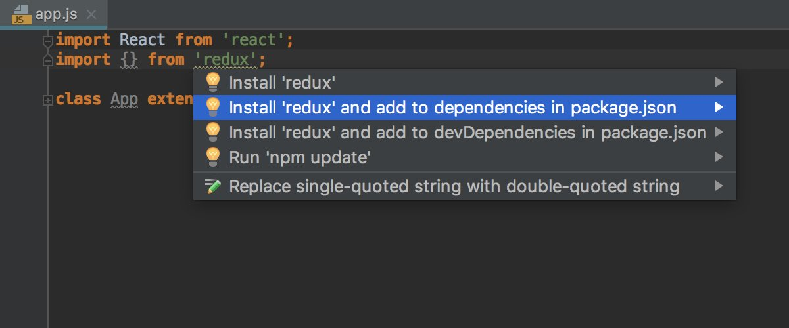
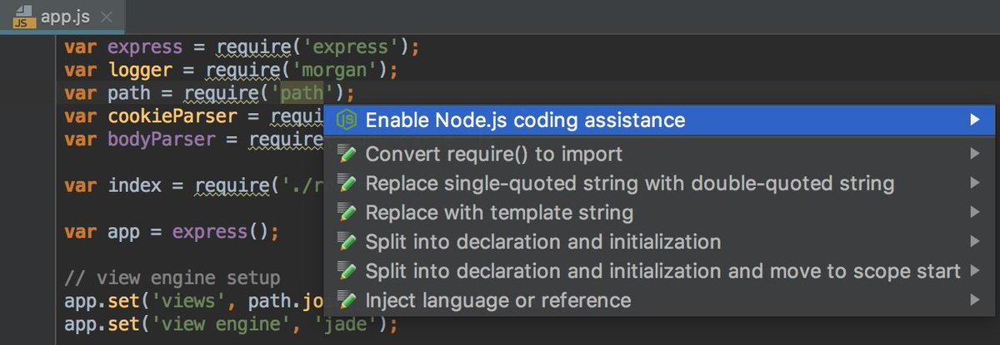
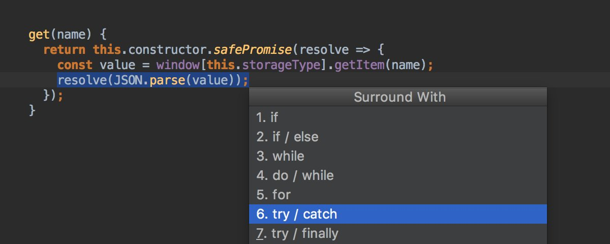

# All WebStorm Tips

[back to index](README.md)

<!--ts-->

<!--te-->

★ - Highly Recommended WebStorm Productivity Tips and Tricks.

<!-- Begin Feb 8  -->

Press Alt-Enter on a class name and select 'Create derived class' to create a new class that extends it.

<video controls style="max-width:100%" src="assets/Dy4cV_NWoAAI8x4.mp4"></video>

Use Ctrl+D/Cmd+D to quickly duplicate a line or block in WebStorm. 

<video controls style="max-width:100%" src="assets/Dyzy5g5WsAAk3_L.mp4"></video>

Rename refactoring in WebStorm is a powerful feature. Preview the changes so so you can rename exactly the code and assets in a project you want. Shortcut: Shift + F6.

<video controls style="max-width:100%" src="assets/Dypnkv_XgAEv3pQ.mp4"></video>

Sometimes you write some unnecessary code, but don't worry, WebStorm has you covered! Just use Alt+Enter to reduce redundant code to a local variable. 

<video controls style="max-width:100%" src="assets/DykbMXyWsAAEIU4.mp4"></video>

**★ Working with Vue.js? Convert chunks of code into Vue components easily with Alt+Enter which invokes WebStorm's Extract Component intention.**

<video controls style="max-width:100%" src="assets/DyVC_pFWoAABq_m.mp4"></video>

**★ Use Ctrl+J/Cmd-J. to launch WebStorm's Live Templates and zip through common HTML elements.**

<video controls style="max-width:100%" src="assets/DyQItqlWsAAs-hO.mp4"></video>

Sometimes, a class works better as a base class. In WebStorm, you can use the Refactor - Extract Superclass feature to refactor your classes with just a few clicks or keystrokes.

<video controls style="max-width:100%" src="assets/DyK34O9X4AEnfjo.mp4"></video>

If you want to improve an "if" expression by flipping the operands or operator, then don't worry, WebStorm has you covered. Use Alt+Enter in the expression and choose an option to flip.

<video controls style="max-width:100%" src="assets/DyF5JVaX0AAAwav.mp4"></video>

Get organized! Move classes to their own file with Alt+Enter in WebStorm. It even creates a meaningful and readable file name based on the class name.

<video controls style="max-width:100%" src="assets/Dxx9t-0WsAAu2kQ.mp4"></video>

Did you know you can type file names in the Project view or the Recent files popup and you will be able to navigate quickly through the list?
The quick search works in any list or tree view in the IDE.

<video controls style="max-width:100%" src="assets/Dxmt7mwWwAAKmrO.mp4"></video>

**★ A lot of time is spent moving code around to get it in the right place. Use `Alt+Shift+Up/Alt+Shift+Down` in WebStorm to move lines up or down.  It's much easier than copy and paste!**

<video controls style="max-width:100%" src="assets/Dxce8xNX0AARe3v.mp4"></video>

Comment and uncomment blocks of code with Ctrl+Shift+/ in WebStorm.

<video controls style="max-width:100%" src="assets/DxNB4brXcAABZRJ.mp4"></video>

**★ Quickly add a `<script>` tag to an html page by dragging and dropping the script file onto the page.**

<video controls style="max-width:100%" src="assets/DxH-wwcW0AADDB2.mp4"></video>

Convert a concatenated string to a modern ES6 template literal just by using Alt+Enter in WebStorm.

<video controls style="max-width:100%" src="assets/DxC7hG7XgAArVBp.mp4"></video>

Use Ctrl+H/Option+H in WebStorm to view and navigate type hierarchies easily with the hierarchy tool window.

<video controls style="max-width:100%" src="assets/Dw9645UWoAACHZP.mp4"></video>

In WebStorm, press Alt+Enter on an expression and choose Introduce Local Variable to quickly create a variable representing that expression.

<video controls style="max-width:100%" src="assets/Dw4avx_W0Agccf8.mp4"></video>

A super quick way to preview a page in WebStorm is to press Alt+F2/Option+F2 then select the browser to launch.

<video controls style="max-width:100%" src="assets/DwpFUo5XcAAPkUI.mp4"></video>

Variable naming is hard. That's why WebStorm suggests variable names based on your class name. Just start typing and you'll see a list to choose from.

<video controls style="max-width:100%" src="assets/Dwj0rr1X0AEzEDK.mp4"></video>

Start the new year with great looking code! Just press Ctrl-Alt-L/Cmd-Alt-L in WebStorm to reformat an entire file!

<video controls style="max-width:100%" src="assets/Dv6aJljWoAAgpzv.mp4"></video>

Are there CSS `<style>` tags lingering in your HTML pages? You can refactor them and move the CSS code to its own file easily by using the Extract to File menu option in WebStorm.

<video controls style="max-width:100%" src="assets/DvgKkNeWoAAmMNa.mp4"></video>

Using the Extract Interface refactoring in TypeScript you can now create a new inteface based on the object structure. That’s available in WebStorm 2018.3.2. 

<video controls style="max-width:100%" src="assets/Du8sWaGXcAE0MzX.mp4"></video>

WebStorm will take care of commas when you move lines up and down in JSON, JavaScript or TypeScript with Shift-Cmd-Up/Down / Ctrl-Shift-Up/Down. 

<video controls style="max-width:100%" src="assets/Du8hvYmW0AACG_8.mp4"></video>

Use WebStorm's TypeScript Tool Window to compile TypeScript to JavaScript.

<video controls style="max-width:100%" src="assets/DvMU4CTX0AEIt9U.mp4"></video>

In WebStorm, you can test Regular Expressions as you write them! Press Alt+Enter/Cmd+Enter at the start of an expression, choose Check RegExp, and see if it works!

<video controls style="max-width:100%" src="assets/Du3yEKIXQAA3ZG0.mp4"></video>

Completion inside the class will suggest methods from the parent class that you can override and will automatically add parameters and super() call.

<video controls style="max-width:100%" src="assets/DuxjXLNW0AEDvxy.mp4"></video>

Want to update your JavaScript code to use arrow functions? Press Alt+Enter and select "Convert to a variable holding an arrow function", and voilà, modern JavaScript!

<video controls style="max-width:100%" src="assets/DuohvRsW0AIlQBT.mp4"></video>

Fancy using class fields in JavaScript? Press Alt-Enter on the undefined property and select Create field. 
And if you want to add getter, press Cmd-N / Alt-Insert and select the corresponding option.

<video controls style="max-width:100%" src="assets/DuX6LyQWsAA6VMy.mp4"></video>

**★ Need to remove a tag? Press `Alt-Enter` and select Remove tag.**

<video controls style="max-width:100%" src="assets/DuUCGGhW4AEK6ie.mp4"></video>

With the new intention you can convert a method to a field with an arrow function – just press Alt-Enter and select the fix!

<video controls style="max-width:100%" src="assets/DuOCsUiWoAAFGAy.mp4"></video>

Structure view and File structure popup (Cmd/Ctrl-F12) now show the names of tests and test suites making it easier to navigate in test files.

Automatically add "super" to your method overrides in TypeScript with WebStorm 2018.3. Start typing the method, press enter when you're ready, and WebStorm completes the method signature and inserts the call to super. 

<video controls style="max-width:100%" src="assets/DtvQfk9XcAElfYn.mp4"></video>

Automatically import dependencies and modules into TypeScript files by pressing Enter when you're ready for WebStorm to fill in the details. 

<video controls style="max-width:100%" src="assets/Dtp-tHUW4AAOAzN.mp4"></video>

WebStorm 2018.3 introduced multi-line TODO comments. Indent comments after the first TODO line so they appear in the TODO window.

<video controls style="max-width:100%" src="assets/DtlBiEdXcAAnJOs.mp4"></video>

**★ Boost your productivity! Quickly switch between files or tool windows in WebStorm by pressing `Alt+E`.**

<video controls style="max-width:100%" src="assets/Dtf5r0_XgAEpYId.mp4"></video>

**★ The Surround With feature in WebStorm is a popular feature for developers who write HTML. Select the elements and press `Alt+Enter` to surround with the HTML you want.**

<video controls style="max-width:100%" src="assets/DtLhFw0W0AUZkGa.mp4"></video>

The `<title>` element is important for accessibility. Screen narrators use it to infer the content of the webpage, since navigating a page to determine its content is time consuming. Press Alt+Enter in WebStorm on the `<head>` tag to quickly insert a `<title>`.

<video controls style="max-width:100%" src="assets/DtFbTbaXoAA5PYr.mp4"></video>

WebStorm 2018.3 automatically shows a quick-fix tip when you forget the "lang" attribute of the `<html>` element. The "lang" attribute is important for both accessibility and localization. Just press Alt + Enter, or click the light bulb to insert your site's default language.

<video controls style="max-width:100%" src="assets/DtAfp61XgAEI7tG.mp4"></video>

It's especially easy to work with JSON data in WebStorm! If you copy JSON that includes special characters such as quotes, WebStorm automatically escapes the data when you paste it.

<video controls style="max-width:100%" src="assets/DssP7x1XQAEPzUe.mp4"></video>

WebStorm already had great TypeScript parameter hints, but now we've added them for straight-up JavaScript too! Check it out!

<video controls style="max-width:100%" src="assets/DsnCCKwWkAERhgn.mp4"></video>

WebStorm 2018.3 can help you adhere to the WCAG recommendations  for accessibility by offering shortcuts for labeling your form's textbox and textarea elements. Just press Alt+Enter to automatically label elements!

<video controls style="max-width:100%" src="assets/DsifLNsWwAAQuqm.mp4"></video>

Want to see documentation when you hover over a symbol? 
Check "Show quick doc on mouse move" in Preferences | Editor | General.
And if you don't want to use the mouse, press F1 to see the docs.

<video controls style="max-width:100%" src="assets/Dr0cYD6WsAMblZV.mp4"></video>

Use the Manage projects action to open recent projects. You can find it with the Find action popup (Cmd/Ctrl-Shift-A)

**★ You can quickly change the UI theme from dark to light or the over way around using the Quick Switch popup (Ctrl-`).**

<video controls style="max-width:100%" src="assets/DrWFItSX0AAK2G4.mp4"></video>

ESLint and TSLint can fix some of the errors they report. To apply this fix in WebStorm, hover over an error and select Fix current error or press Alt-Enter and select Fix current file.

<video controls style="max-width:100%" src="assets/Dqxctz3WoAAPQU9.mp4"></video>

**★ To jump between style / html / typescript files of your #Angular component:**

- **use "Jump to Navigation Bar" shortcut (`⌘+↑` or `[alt]+[home]`)** 
- **and press `arrow down` or start typing the extension**

<video controls style="max-width:100%" src="assets/6eCYeba34eUpJUNV.mp4"></video>

When you use code completion for paths, press Ctrl-Space again to see all project files in suggestions. Works in JavaScript, style sheet, and HTML files.

<video controls style="max-width:100%" src="assets/DqIBKRQWoAAvJyg.mp4"></video>

Want to run a single test? Click on the icon next to it in the editor and select Run. Or put the caret somewhere in the test and press Ctrl-Shift-R on macOS or Ctrl-Shift-F10 on Windows or Linux.

Copy and paste the code from one file to another and WebStorm will add all the required imports automatically.

<video controls style="max-width:100%" src="assets/DpkCBOYWsAIxU5K.mp4"></video>

Press Cmd-Shift-T / Ctrl-Shift-T to navigate from a file to a related test file and back.

<video controls style="max-width:100%" src="assets/DpUSLjrXUAAUQ_M.mp4"></video>

You can copy and paste multiple values at the same time when using multiple cursors. Hold Alt and then click or drag to add extra cursors.

<video controls style="max-width:100%" src="assets/DpKIyWYWkAAEFCw.mp4"></video>

If you access class members inside the class, WebStorm will automatically add ‘.this’ before the fields and methods for you.

<video controls style="max-width:100%" src="assets/Do_5qyPXoAAdxPc.mp4"></video>

Did you know that the Rename refactoring can not only change the file name, but also the class name and all its usages if it matches the name of the file.
➡️ Press Shift-F6 or use Refactor this - Rename (Ctrl-T on macOS / Ctrl-Alt-Shift-T on Windows & Linux).

<video controls style="max-width:100%" src="assets/DowFaVcWwAcygwZ.mp4"></video>

Want to go back to the tab you’ve just closed? Use the Reopen closed tab action or find it in the Recent files popup (Cmd/Ctrl-E).

<video controls style="max-width:100%" src="assets/DocAUKDXgAIyh08.mp4"></video>

Pin a tab to prevent it from closing automatically when the number of tabs exceeds the limit set in Preferences | Editor | General | Editor Tabs. 
And you can use Close All but Pinned to close all other tabs.

<video controls style="max-width:100%" src="assets/Dn8NQIuXoAAXghN.mp4"></video>

If there's a number next to the action name, press the corresponding number on the keyboard to run it.

**★ Spotted a warning?**
- **Hover over it or press `Cmd/Ctrl-F1` to see the description and the first quick-fix**
- **To apply the fix, click it or use `Alt-Shift-Enter**`
- **Press `Alt-Enter` to see all fixes and intentions**

<video controls style="max-width:100%" src="assets/DnDirWnXgAApxfR.mp4"></video>

Select the code and press “, (, [ or { to surround it with quotes or braces. 
And if you select the whole string, press ` to replace quotes with backticks. 

<video controls style="max-width:100%" src="assets/DmgValNWwAEAYVK.mp4"></video>

With the Browse Repository at Revision action in Git Log, you can see the full state of the project and its files in read-only mode without checking out this revision.

With the Git - Compare with Branch action, you can see the diff between your local file and the same file in the selected branch.

Did you know that you can now debug JavaScript scratch files using Node.js? 

1. Create a new scratch with Cmd-Shift-N on macOS or Ctrl+Shift+Alt+Insert on Windows and Linux.
2. Put a breakpoint in the code.
3. Press Ctrl-Alt-D or Alt+Shift+F9 to start debugging.

<video controls style="max-width:100%" src="assets/DlrFcXKXsAEvz5y.mp4"></video>

If you're using nodemon for your Node.js app and want to debug it in WebStorm, don't forget to check 'Reconnect automatically' in the Attach to Node.js debug configuration. 

**★ Press `Shift-Cmd/Ctrl-C` to copy a full path to the current file. And if you want a path from the project root, select file in the project view and press `Alt-Shift-Cmd/Ctrl-C`**

Did you know that you can create files AND directories using the New - File action (Cmd-N/Alt+Insert)?

<video controls style="max-width:100%" src="assets/DkzRClVXgAE9llb.mp4"></video>

**★ In JSON configs WebStorm can auto-complete the properties, show descriptions for them and possible values.**
**Based on the file name, WebStorm picks a JSON Schema file from [http://schemastore.org/json/ ](https://t.co/tWKU0dJmsv), but you can select a different schema in the status bar.**

<video controls style="max-width:100%" src="assets/DkuV0CRXgAA-BCy.mp4"></video>

Did you know that the documentation popup (F1) can show the image preview 🔎?

<video controls style="max-width:100%" src="assets/DkkjX0SX0AAKPfO.mp4"></video>

**★ With postfix completion you can add a snippet around an expression you’ve just typed.**

<video controls style="max-width:100%" src="assets/DkFVBO_W4AAmGD-.mp4"></video>

Press Alt-Enter to convert a type alias with string literals in it into an enum in TypeScript.

<video controls style="max-width:100%" src="assets/DkAwDvPX4AAdLIw.mp4"></video>

You can add and remove digit separators in JavaScript using the new intentions (press Alt-Enter) in WebStorm 2018.2.

<video controls style="max-width:100%" src="assets/Dj6uOvNX0AE-EzM.mp4"></video>

In WebStorm 2018.2 you can now remove, disable and configure breakpoints with the intention actions - simply press Alt-Enter on the line with the breakpoint and select the action you need

WebStorm 2018.2 now has a collection of React code snippets.
Type the abbreviation and press Tab to expand it or press Cmd/Ctrl-J and select a snippet from the list. 
Find a full list of snippets in Preferences | Editor | Live Templates.

<video controls style="max-width:100%" src="assets/DjHySOXW0AAWQxh.mp4"></video>

**★ Jump to the definition, see the usages or open a different file – you can always go back to the file and line where you’ve started using the Navigate Back action (`Cmd-[` on macOS and `Ctrl-Alt-Left` on Windows and Linux)**

<video controls style="max-width:100%" src="assets/DijhwgTWAAAl0XP.mp4"></video>

**★ You can remove braces from the arrow function or add them with the quick fix - press `Alt-Enter` and choose the action you need.**

<video controls style="max-width:100%" src="assets/DhrKG0iWsAAlKul.mp4"></video>

Structure view can show methods and fields inherited from the parent class or interface – click 'Show inherited' to see them.

**★ One of the ways to add a new dependency to your project is to add an import statement, then press `Alt-Enter` and select “Install and add to dependencies/devDependencies in package.json”**

Add a comment that starts with TODO or FIXME as a reminder to do something in the code. You can then see all these reminders in the TODO window. When you commit a file, WebStorm will check that it doesn’t have any unresolved to-dos.

Want to create a reusable code snippet? Select the code in the editor and use the Save as Live Template action. 

Surround your expression with template code using postfix completion: type . and the abbreviation, then press Enter.
Find available templates in Preferences | Editor | General | Postfix Completion. And add your own in WebStorm 2018.2 EAP.

<video controls style="max-width:100%" src="assets/DfAxGTIWAAEDmzc.mp4"></video>

Use the Move refactoring (F6) to move a symbol to another file: 🅰️➡️🅱️
WebStorm will take care of everything else: it will copy the related imports and update paths in imports in all the files where it’s used.

<video controls style="max-width:100%" src="assets/DemgSpSW4AEocTc.mp4"></video>

Use Related Symbols... action (Ctrl-Cmd-Up on macOS and Ctrl+Alt+Home on Windows and Linux) to quickly jump from the current file to the definition of imported symbols.

Optimize imports (Ctrl-Alt-O) helps you keep the import section in your JavaScript and TypeScript files clean and organized. 

<video controls style="max-width:100%" src="assets/DdKk-0eWkAY4Rjx.mp4"></video>

**★ With Select All Occurrences (`Ctrl-Cmd-G` on macOS or `Shift-Ctrl-Alt-J` on Windows and Linux) you can edit all the occurrences of the current word or selected symbols in the file. Press `Esc` to remove selection.**

<video controls style="max-width:100%" src="assets/Dc1wykAW0AEAP8X.mp4"></video>

When editing JavaScript or TypeScript, Quick Documentation (F1) for the standard JavaScript methods will show you a link to the corresponding MDN article.

Press F1 when the completion popup is open or when the caret is inside the image path and see the image preview

WebStorm 2018.1 will warn you if the installed version of the dependency doesn't match the version range in package.json. You can press Alt-Enter to update the dependencies.

<video controls style="max-width:100%" src="assets/DboVYG0X0AARYv9.mp4"></video>

Did you know that in the methods that take a callback function as a parameter, you can press Ctrl-Space to insert an arrow function?

In the JavaScript and TypeScript calsses, press Ctrl-O to select methods from the base class that you want to override

<video controls style="max-width:100%" src="assets/DalyuEAXkAETxGY.mp4"></video>

For the React attributes in JSX, you can add quotes or braces after the `=` sign. You can configure what WebStorm adds in Preferences | Editor | Code Style - HTML - Add for JSX attributes. Select "Based on type" if you want WebStorm to guess the best option.

<video controls style="max-width:100%" src="assets/DaWjRTwXcAANR11.mp4"></video>

Use Refactor - Rename (Shift-F6) for a class and WebStorm will also suggest renaming the file if it had the same name.
And of course, it will update all the usages of the class and file.

<video controls style="max-width:100%" src="assets/DaCATBOXcAYCUbr.mp4"></video>

Want to change the filename to match the name of the class? Just press Alt-Enter and select Rename file.
And you can select the filename convention in the Code Generation section of the JavaScript and TypeScript code style settings.

Press a green icon next to an npm script to run it. 

Paste the HTML code to the React component and WebStorm will replace `class` attributes and on-event handlers with `className`, `onClick`, `onChange`, etc.

<video controls style="max-width:100%" src="assets/DZiPMBfX0AAow1y.mp4"></video>

Press Cmd/Ctrl and hover over a package name in package.json to see its description and the latest available version.

To convert a CommonJS module to an ES module, press Alt-Enter on `module.exports` or `require` and select a corresponding intention

<video controls style="max-width:100%" src="assets/DY54I2QXcAY4-TB.mp4"></video>

In package.json, press Ctrl-Space after the package name to see its latest versions for different tags.

Want to hide all the tool windows and panels and concentrate on the code? Use the Distraction Free Mode – press Ctrl-` - View Mode

To extract a type in a TypeScript file, use Refactor This - Extract Type Alias (Ctrl-T on macOS / Ctrl-Alt-Shift-T on Windows & Linux)

<video controls style="max-width:100%" src="assets/DXTGEW-XUAE4rGc.mp4"></video>

In package.json, press F1 on a package name to see its readme file

Move the statement up and down with Cmd-Shift-Up/Down on macOS or Ctrl-Shift-Up/Down on Windows or Linux. Depending on the cursor position you will move just one line or a whole block of code.

<video controls style="max-width:100%" src="assets/DWK24DVXkAEy0VY.mp4"></video>

No matter how many files you’ve opened since making the last edit, jump back to the last line you edited by pressing Shift-Cmd-Delete on macOS or Ctrl-Shift-Backspace on Windows or Linux

<video controls style="max-width:100%" src="assets/DWF0DM1X4AAnPUS.mp4"></video>

Want to skip some lines and stop on a not yet executed line while debugging, put a cursor in it and use “Run to Cursor” (Alt-F9)

<video controls style="max-width:100%" src="assets/DVm_adfUQAESR3E.mp4"></video>

**★ Press Alt-Enter on `require('path')` or any other Node.js core module, to enable code completion for all Node.js methods.**

Extract Vue component intention and brings lots of improvements in the React Native support! 

<video controls style="max-width:100%" src="assets/DU9qZRvWAAEQzVD.mp4"></video>

See a full list of available code snippets for Vue.js in Preferences | Editor | Live Templates – type the abbreviation in your component – press Tab – voilà!

<video controls style="max-width:100%" src="assets/DUzHDlaXkAEt9uU.mp4"></video>

Press Esc to jump back to the editor from any tool window

<video controls style="max-width:100%" src="assets/DTHBBe-WAAIn0Th.mp4"></video>

You can now use ChromeDevTools and WebStorm's debugger at the same time! Put the breakpoint, resume the execution and step through the code in any tool – all is synchronized!

<video controls style="max-width:100%" src="assets/DTBrHKsWAAE-ldv.mp4"></video>

Generate getter and setter for a selected field with Generate code - Getter and Setter (Cmd-N / Alt+Insert)

<video controls style="max-width:100%" src="assets/DSyZoJJXcAAVAfw.mp4"></video>

Hit Alt-Enter on the class name to implement all the members it gets from the interfaces

<video controls style="max-width:100%" src="assets/DRqSMaRXkAArAxe.mp4"></video>

WebStorm can help you to convert functions with prototype chains into ES6 class. Hit Alt-Enter on the function - Convert to class

<video controls style="max-width:100%" src="assets/DRk8GyHXUAc_hLD.mp4"></video>

Want to convert strings and expressions into a template string? 
That's easy: press Alt-Enter and then select "Replace with template string"

<video controls style="max-width:100%" src="assets/DRfubAYX4AEjCkZ.mp4"></video>

Navigate from a file to a related test file and back with Cmd-Shift-T / Ctrl-Shift-T

<video controls style="max-width:100%" src="assets/DQ8NcWSWAAAlsLD.mp4"></video>

Extract parameter (Alt-Cmd-P / Ctrl-Alt-P) now uses default parameter syntax for optional parameters

<video controls style="max-width:100%" src="assets/DQXv31WWsAAodKv.mp4"></video>

Create a new single file Vue component using New file... (Cmd-N / Alt-Insert)

<video controls style="max-width:100%" src="assets/DQNnN0LXcAIeC7a.mp4"></video>

When debugging, hover over expression and click + or use Quick evaluate expression action (Alt-Cmd/Ctrl-F8) to see its value

<video controls style="max-width:100%" src="assets/DNtf87CWsAAmiKa.mp4"></video>

**★ Right-click on the project root and select Local History - Show History to see and revert the recent changes**

With Generate code (Cmd-N / Alt+Insert) you can quickly add a constructor or implement methods of the parent class or interface

<video controls style="max-width:100%" src="assets/DM6GoybXUAAE_Hi.mp4"></video>

Right-click on a breakpoint to add a condition and it will only be hit when the condition is true.

Convert CSS properties into a shorthand declaration: hit Alt-Enter on the highlighted code and select Optimize properties

You can quickly jump to variables, classes and methods in the file with the File Structure popup (Cmd/Ctrl-F12) 

<video controls style="max-width:100%" src="assets/DLOGeP6XoAEH8tY.mp4"></video>

Quickly open recent projects with the Manage projects action available via Find action (Cmd/Ctrl-Shift-A)

A quick way to remove parent HTML tag: select Unwrap/Remove via Find action or hit Shift-Cmd-Fn-Delete / Shift-Ctrl-Delete

<video controls style="max-width:100%" src="assets/DI5A8k9WAAAvmK6.mp4"></video>

**★ Select the code, hit `Alt-Cmd-T` / `Ctrl-Alt-T` and select the statements you can quickly surround the code with.**

Hit Ctrl-Space twice to get path completion for all files in the project; once – modules, dirs & files in the same folder

<video controls style="max-width:100%" src="assets/DH_rvjrXgAE2Sw6.mp4"></video>

**★ With postfix templates you can quickly introduce variables: type `.<var/let/const>` and hit Tab to expand**

<video controls style="max-width:100%" src="assets/DH1rWwpXcAEDutI.mp4"></video>

**★ in JSX type `/` at the end of the Emmet abbreviation to expand it into a self-closing tag**

<video controls style="max-width:100%" src="assets/DHXQOoLXkAIaS5G.mp4"></video>

Convert an anonymous function to an arrow function - hit Alt-Enter on it and select Convert

<video controls style="max-width:100%" src="assets/DFsj0FWU0AAeiSN.mp4"></video>

To see only failed tests in the test tool window uncheck the "Show passed tests" button

Press ^G / Alt-J to select the next occurrence of the word and ^⌘G  / Shift-Ctrl-Alt-J to select all occurrences

<video controls style="max-width:100%" src="assets/DAcYFbFXUAEeb3c.mp4"></video>

**★ Quickly see a list of usages with Show usages action – `Alt-Cmd-F7` on macOS or `Ctrl-Alt-F7` on Windows & Linux**

**★ To see information on function or method parameters hit `Cmd-P` on macOS or `Ctrl-P` on Windows and Linux**

<!-- End 22 Dec 2016  -->

<!-- controls style="max-width:100%" -->