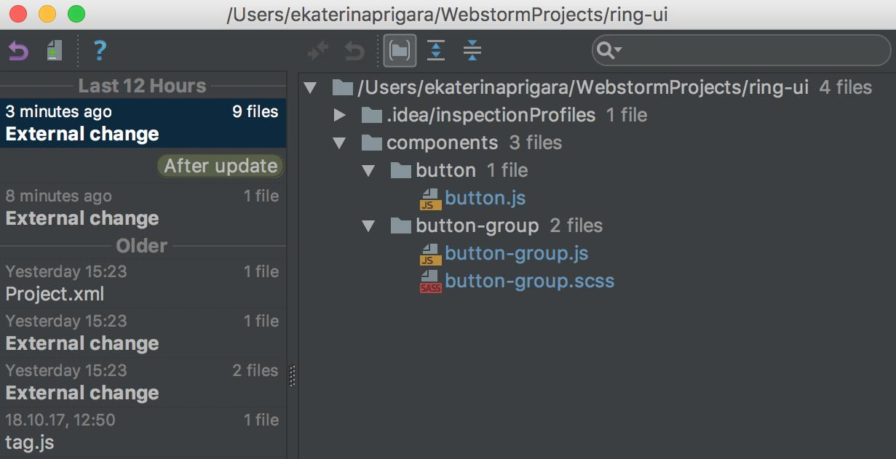
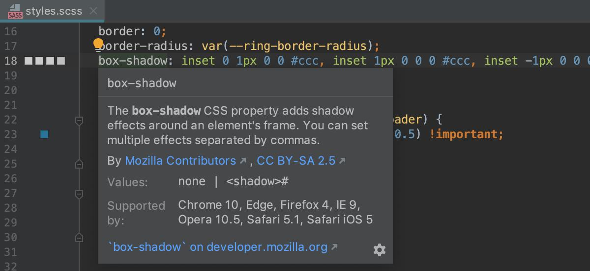
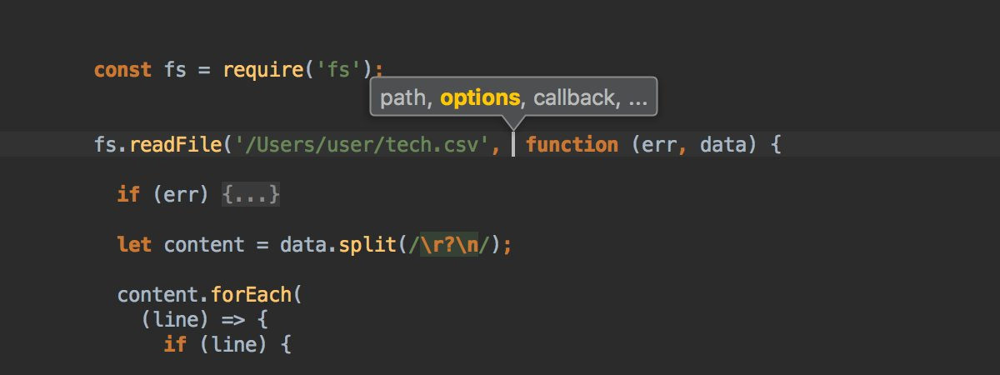

# All WebStorm Tips

[back to index](README.md)

<!--ts-->

<!--te-->

★ - Highly Recommended WebStorm Productivity Tips and Tricks.

<!-- Begin Jul 9, 2020 -->

**★ In WebStormIDE you can `⌘+Click` / `Ctrl+Click` on a tab that will show a popup to reveal that specific file in finder**

<video controls style="max-width:100%" src="assets/WebStormIDE-1280866829427187713.mp4"></video>

Install the Awesome Console plugin from Preferences/Settings \| Plugins to make all files in the Run and Terminal tool windows clickable.

<video controls style="max-width:100%" src="assets/WebStormIDE-1280161965994921984.mp4"></video>

Have package.json opened in the editor and want to start an npm script? Click on the Run icon next to the script name and select Run. 

<video controls style="max-width:100%" src="assets/WebStormIDE-1276534936028221441.mp4"></video>

Have way too many tabs open and need to close them all quickly? Right-click on the tab you want to keep and select `Close Others`.

<video controls style="max-width:100%" src="assets/WebStormIDE-1275082364826214400.mp4"></video>

Install the [Randomness plugin](https://blog.jetbrains.com/webstorm/2020/05/plugins-for-webstorm-you-need-to-know-about/#randomness) from Preferences/Settings \| Plugins if you're getting stuck coming up with some random data for your project. This plugin allows you to insert random numbers, strings, and UUIDs.

**★ Use `Alt+Right` / `Alt+Left` on Windows/Linux or `Shift+Cmd+]` / `Shift+Cmd+[` on macOS to quickly move between tabs.**

<video controls style="max-width:100%" src="assets/WebStormIDE-1270371631832223744.mp4"></video>

Use the Switch popup to preview a theme before changing it. Press Ctrl+` and go to Theme, then choose the theme that you like and hit Enter to apply it.

<video controls style="max-width:100%" src="assets/WebStormIDE-1268916500280283139.mp4"></video>

Did you know that you can change the default view mode of any tool window? For example, you can make a tool window visible only when active or detach it from the tool window bar.

<video controls style="max-width:100%" src="assets/WebStormIDE-1267482027189772295.mp4"></video>

The [Quick File Preview plugin](https://blog.jetbrains.com/webstorm/2020/05/plugins-for-webstorm-you-need-to-know-about/) can help you speed up the process of browsing through the content of each file. It allows you to preview project files in the editor whenever you select them in the Project view.

<video controls style="max-width:100%" src="assets/WebStormIDE-1266380263573069824.mp4"></video>

To find a specific test in a large test file, open the Structure view (`Cmd+7` / `Alt+7`) and start typing the test name. Press `Cmd+Down` on macOS or `F4` on Windows/Linux to jump back to the code.

<video controls style="max-width:100%" src="assets/WebStormIDE-1262401182498242562.mp4"></video>

Use the Complete Current Statement functionality (`Shift-Cmd-Enter` on macOS and `Shift-Ctrl-Enter` on Windows/Linux) to add curly braces and move the cursor with one keystroke.

<video controls style="max-width:100%" src="assets/WebStormIDE-1260580517185028096.mp4"></video>

Hover over a symbol to see the related documentation.

<video controls style="max-width:100%" src="assets/WebStormIDE-1258440619015503874.mp4"></video>

Webstorm Latest version has a cool feature: autocomplete for Vuex!

<video controls style="max-width:100%" src="assets/ale_jarvis-1255953046233808900.mp4"></video>

Working with the built-in terminal and want to keep an eye on the output of several tools without switching between tabs? Right-click anywhere in the terminal area and select Split Vertically/Split Horizontally from the context menu.

Postfix templates in WebStormIDE are awesome! 

<video controls style="max-width:100%" src="assets/idnan_se-1255212961431539718.mp4"></video>

Want to run Prettier on save in all new projects? From the main menu, go to File \| New Project Settings \| Preferences/Settings for New Projects, then tick `Run on save for files` in Languages & Frameworks \| JavaScript \| Prettier.

Meet the [WebStorm Guide](https://blog.jetbrains.com/webstorm/2020/04/webstorm-guide/), a central place for tips and tricks on how to use WebStorm efficiently! We hope it helps you learn something new without requiring you to spend too much time away from the projects you're working on.

With this new intention (`Alt+Enter`), you can quickly infer parameter type annotations or JSDoc types from function calls.

<video controls style="max-width:100%" src="assets/WebStormIDE-1253021358331748352.mp4"></video>

You can now decide on what exactly you’d like to have on the status bar. For this, right-click the status bar and untick each element you don't want to see there.

<video controls style="max-width:100%" src="assets/WebStormIDE-1252251160645427205.mp4"></video>

Clean code is nice, and so is clean grammar! That's why WebStorm is now bundled with Grazie, our spelling, grammar, and style checking tool.

Use the new intention (`Alt+Enter`) to quickly convert the existing code to optional chaining and/or nullish coalescing, the syntax introduced in the latest versions of TypeScript and JavaScript.

<video controls style="max-width:100%" src="assets/WebStormIDE-1250796310082605056.mp4"></video>

New to WebStorm and want to get the hang of some basics? Install the IDE Features Trainer plugin! With its help, you can interactively learn how to do some common jobs, such as refactoring code, navigating through projects, and more.

With the new Zen mode, you can focus completely on your code. When it's on, you'll see a full-screen editor with your code centered and the UI elements hidden. To turn the new mode on/off, press Ctrl+`, then select View Mode > Enter/Exit Zen Mode.

Want to make indentation more readable and find problems with it faster? The Indent Rainbow plugin can help do both! Install it from Preferences/Settings \| Plugins to have all indents colorized. If the wrong indentation is used, the line will be highlighted in red.

Install the [String Manipulation plugin](https://plugins.jetbrains.com/plugin/2162-string-manipulation) from Preferences/Settings \| Plugins to get support for advanced text manipulation actions such as switching from camelCase to kebab-lowercase and much more.

<video controls style="max-width:100%" src="assets/WebStormIDE-1245402349692235784.mp4"></video>

Select a code fragment and press `Cmd/Ctrl+Shift+U` to switch from lower to upper case or vice versa.

<video controls style="max-width:100%" src="assets/WebStormIDE-1245009876738334721.mp4"></video>

Turn on semantic highlighting to extend the standard syntax highlighting with unique colors and make it easier to distinguish between many parameters and local variables.

<video controls style="max-width:100%" src="assets/WebStormIDE-1242854644050771968.mp4"></video>

Need to present at meetings or online events, record screencasts or do pair programming? Install the Presentation Assistant plugin from Preferences/Settings \| Plugins - it will display the shortcuts you used and make it easier for the audience to follow your actions.

<video controls style="max-width:100%" src="assets/WebStormIDE-1242487510317461509.mp4"></video>

Need to open a project folder in a terminal emulator? Right-click on that folder and select Open in Terminal – this will launch the built-in terminal emulator right at that folder’s path.

<video controls style="max-width:100%" src="assets/WebStormIDE-1242111343345512449.mp4"></video>

How to work with several projects in one IDE window:
- Select File \| Open from the main menu & choose the project you want to work with
- In the appeared dialog, click `Attach`
- If you no longer need that project, right-click it & select `Remove from Project View`

Have you tried the Rainbow Brackets plugin? [https://plugins.jetbrains.com/plugin/10080-rainbow-brackets](https://plugins.jetbrains.com/plugin/10080-rainbow-brackets). 
It colors the brackets and makes it easier to see where the block starts and ends.

Did you know that you can quickly hide/restore all active tool windows with `Cmd+Shift+F12` / `Ctrl+Shift+F12`?

<video controls style="max-width:100%" src="assets/WebStormIDE-1235242372142960640.mp4"></video>

New to WebStorm or simply want to transition to faster, mouse-free development? Install the Key Promoter X plugin from Preferences/Settings \| Plugins. This plugin can help you learn some essential shortcuts while you're working.

Press `Ctrl-/Ctrl+` on Windows/Linux and `Cmd-/Cmd+` on macOS to quickly fold and unfold a code fragment. To collapse or expand all code fragments in a file, press the same keys and Shift.

<video controls style="max-width:100%" src="assets/WebStormIDE-1232708491929845761.mp4"></video>

How to share code with gists:
1. In the Project tool window, right-click the file you want to share/right-click anywhere in the editor area and select `Create Gist`.
2. Specify all the necessary details in the Create Gist dialog and hit OK.

Did you know that you can quickly close any tool window with `Shift+Esc`?

<video controls style="max-width:100%" src="assets/WebStormIDE-1230153981105754112.mp4"></video>

Install the Extra Icons plugin from Preferences \| Plugins to have some custom file icons in your project (works for all default and some custom themes). The full list of available icons can be found in Preferences \| Appearance & Behavior \| Extra Icons.

**★ Use `Ctrl+Shift+J` in WebStorm to easily join lines or blocks of code. **

<video controls style="max-width:100%" src="assets/WebStormIDE-1228330494632374272.mp4"></video>

Did you know that you can swiftly jump to the last opened file with `Ctrl-Tab`? And, if you hold the `Ctrl` key and press `Tab`, you'll see the Switcher popup which you can use for jumping between tool windows and other recently opened files, also with Tab.

<video controls style="max-width:100%" src="assets/WebStormIDE-1224345925344276480.mp4"></video>

Press `Cmd/Ctrl-Alt-J` and select Emmet to surround a block of code with an Emmet template. This also allows you to wrap individual lines if you’re using * in the abbreviation.

<video controls style="max-width:100%" src="assets/WebStormIDE-1223260104922927105.mp4"></video>

To quickly sort lines alphabetically, select them in the editor and choose Edit \| Sort Lines from the main menu or run this action using the Find Action command (`Cmd/Ctrl-Shift-A`).

<video controls style="max-width:100%" src="assets/WebStormIDE-1220359794684518402.mp4"></video>

Drag the script file to your HTML code and drop it there to quickly add the `<script>` tag.

<video controls style="max-width:100%" src="assets/WebStormIDE-1219653754246651904.mp4"></video>

With the Recent Locations popup (`Cmd/Ctrl-Shift-E`), you can preview the part of code and files you’ve recently opened in the editor and quickly get back to them.

If you’re using a tool like Prettier for a project and have it configured via a file watcher, you can automatically apply this configuration to all new projects. For this, tick "Enabled" in Preferences \| Tools \| File Watchers when adding a new global file watcher.

Need to push changes from one branch while working with the other? With the latest update, you no longer need to switch to the branch you want to push changes from – simply select it from the Branches popup and hit Push.

Want to include the name of the changed file in your commit message? You can now do it faster as WebStorm will autocomplete it for you.

Want to inject a code fragment in a language different from the main language of the file, like an HTML string in a JavaScript file? Press `Alt-Enter`, select Inject Language or Reference, and then pick a language from the list.

<video controls style="max-width:100%" src="assets/WebStormIDE-1202263561369800704.mp4"></video>

**★ Need to launch tools like npm and Yarn, open recent projects, or start a run configuration? You can now do it all from one place using the Run Anything action (`Ctrl-Ctrl`).**

<video controls style="max-width:100%" src="assets/WebStormIDE-1200449949667938305.mp4"></video>

If you’re using Bootstrap or another CSS library linked from a CDN, you can now get completion for the class names from that library – no need to add its sources to the project. For this, hit `Alt-Enter` on the link in the HTML file and select Download library.

Need to build apps with Next.js and use styled-jsx? Install the Styled Components and Styled JSX plugin to get code completion for CSS in your components: [https://plugins.jetbrains.com/plugin/9997-styled-components--styled-jsx](https://plugins.jetbrains.com/plugin/9997-styled-components--styled-jsx)

When debugging, use the Evaluate dialog (`Alt-F8`) to quickly check the value of an expression.

<video controls style="max-width:100%" src="assets/WebStormIDE-1194642138237198336.mp4"></video>

Did you know that WebStorm can automatically add an import for a symbol even if you’re using default exports?

<video controls style="max-width:100%" src="assets/WebStormIDE-1193881081596071936.mp4"></video>

WebStorm can warn you when you use a CSS property that is not supported by the target browser. 
Go to Preferences \| Editor \| Inspections and enable the Browser compatibility inspection.

**★ You can swap function parameters, attributes in tags, and elements in objects, arrays and boolean expressions using Move Element Left/Right:**
- `Alt-Shift-Cmd-Left/Right` on macOS
- `Alt-Shift-Ctrl-Left/Right` on Windows and Linux

<video controls style="max-width:100%" src="assets/WebStormIDE-1189213262233161731.mp4"></video>

**★ Don't need to commit all the changes made in a file? No problem!
Use checkboxes in the diff view of the commit dialog to select those you want to commit.**

<video controls style="max-width:100%" src="assets/WebStormIDE-1188857951089549313.mp4"></video>

If you want to temporarily disable an ESLint rule, WebStorm can help you with that: hover over the warning and select Suppress for current line. 

<video controls style="max-width:100%" src="assets/WebStormIDE-1187401294568398848.mp4"></video>

With WebStorm, you can quickly access your clipboard history with `Ctrl-Shift-V` / `Cmd-Shift-V` and paste any of the recent items copied there into an opened file.

<video controls style="max-width:100%" src="assets/WebStormIDE-1186301294492954624.mp4"></video>

Need to convert a function that returns a Promise to an async function that uses the async/await syntax? Simply place the caret on that function, press `Alt-Enter` and select "Convert to async function".

<video controls style="max-width:100%" src="assets/WebStormIDE-1184488935680069633.mp4"></video>

With Navigation Bar you can quickly open files in the project tree. 
- Press `Cmd-Up` on macOS or `Alt-Home` on Windows and Linux.
- Use arrows to get to the target directory and file.
- Press `Enter` to open a file. 

<video controls style="max-width:100%" src="assets/WebStormIDE-1184137355176923139.mp4"></video>

**★ In WebStorm, you can test regular expressions on the fly. For this, place the caret at the expression you want to test, press `Alt+Enter`, select “Check RegExp” and then try a few sample combinations in the appeared popup.**

<video controls style="max-width:100%" src="assets/WebStormIDE-1181932793800134658.mp4"></video>

Whenever you’re presenting at conferences or company events, use the Presentation mode which makes it easier for the audience to see what’s going on in the editor (Ctrl + ` \| View Mode \| Enter Presentation Mode). 

Ever been in a situation where you accidentally deleted the code you’d been working on for a while? With Local History, you can quickly get it back: right-click on the project root, select Local History \| Show History & restore what's needed.

You can preview images right from the Project view – just press `Alt-Space` on macOS or `Ctrl-Shift-I` on Windows and Linux.

<video controls style="max-width:100%" src="assets/WebStormIDE-1176539339427328000.mp4"></video>

Need to add `console.log()`? Type `log` and press `Tab`. Or first type value, then `.log` and Tab.

<video controls style="max-width:100%" src="assets/WebStormIDE-1176165787998052352.mp4"></video>

**★ With Complete Current Statement (`Shift-Cmd-Enter` on macOS and `Shift-Ctrl-Enter` on Windows and Linux) you can add curly braces and move the cursor with one keystroke.**

<video controls style="max-width:100%" src="assets/WebStormIDE-1173595894366605312.mp4"></video>

Arrow functions? Yes, please! Press `Alt-Enter` to convert a function to an arrow function.

<video controls style="max-width:100%" src="assets/WebStormIDE-1172504452776906752.mp4"></video>

Did you know that you can extract a type alias in your TypeScript code using a familiar shortcut for the Extract variable refactoring: `Cmd-Alt-V` on macOS and `Ctrl-Alt-V` on Windows and Linux. 

<video controls style="max-width:100%" src="assets/WebStormIDE-1172139548245143552.mp4"></video>

Multi cursor selection in WebStorm:
- Select next occurrence of the current word or selection: `Ctrl-G` on macOS and `Alt-J` on Windows and Linux
- Select all occurrences: `Ctrl-Cmd-G` / `Shift-Ctrl-Alt-J`

<video controls style="max-width:100%" src="assets/WebStormIDE-1171788736746545154.mp4"></video>

Want to use a template string (aka template literal) instead of a regular string? 

Simply press `Alt-Enter` and select Replace with template string. 

<video controls style="max-width:100%" src="assets/WebStormIDE-1169641183267774465.mp4"></video>

The blue icon next to the branch name in the Branches popup will let you know if this branch has any new incoming commits.

Need to test an HTTP request?
- Create a new HTTP Request scratch file (`Shift-Cmd-N` / `Ctrl-Alt-Shift-Insert`)
- Type the request
- Click Run next to it 
- See the results in the tool window 

<video controls style="max-width:100%" src="assets/WebStormIDE-1167101970777288705.mp4"></video>

You can do multiline searches with Find and Replace in file – press `Ctrl/Cmd-Shift-Enter` to add a new line.

WebStorm will make sure you haven't forgotten to add `this`. 

<video controls style="max-width:100%" src="assets/WebStormIDE-1164210986523299840.mp4"></video>

If a test is failing, on hover, you’ll see the error message from the test runner. Press `Alt-Shift-Enter` to immediately start debugging the test. 

In TypeScript, press `Cmd` on macOS or `Ctrl` on Windows and Linux and hover over a symbol to see its type.

When adding a new dependency in package.json, WebStorm will show you the latest available version for it.

the IDE will warn you if the boolean expression has some unnecessary parts and could be simplified -  press Alt-Enter to do that.

<video controls style="max-width:100%" src="assets/WebStormIDE-1161675443650670594-1.jpg"></video>

Enable Method Separators in Preferences \| Editor \| General \| Appearance to make it easier to read the code – they appear between functions and class methods.

**★ The Search Everything popup (`Shift-Shift`) shows you the files you've recently opened. 
Hold `Shift + Up` or `Shift + Down` to select several files and press Enter to reopen them.**

<video controls style="max-width:100%" src="assets/WebStormIDE-1159109441532264448.mp4"></video>

Need to use the built-in Terminal? Press `Alt-F12` to jump to it from the editor; go back with the `Esc` key.

<video controls style="max-width:100%" src="assets/WebStormIDE-1158393158587359233.mp4"></video>

Click on the filter icon in the debugger Frames panel to hide calls from 3rd-party code e.g. project dependencies in the node_modules folder.

<video controls style="max-width:100%" src="assets/WebStormIDE-1156235597201268736.mp4"></video>

when debugging, use the Smart Step Into (`Shift-F7`) if you want to skip some chained or nested calls and step directly into the one you need. With the updated UI, it's even easier to do now.

<video controls style="max-width:100%" src="assets/WebStormIDE-1154426766116761601.mp4"></video>

**★ completion after the `import` keyword will now suggest you symbols that are exported as default and will automatically add the path.**

<video controls style="max-width:100%" src="assets/WebStormIDE-1154066724150480898.mp4"></video>

How to quickly create a code snippet:
- Select the code
- Press `Cmd/Ctrl-Shift-A` and type "Save as Live Template"
- Set abbreviation and description
- Save

You can modify your snippet by adding variables to it.

<video controls style="max-width:100%" src="assets/WebStormIDE-1152238605747871744.mp4"></video>

You can see the color you're using in the stylesheet as a background for the color value – enable this option in Preferences \| Editor \| General \| Appearance

Right-click on a breakpoint to configure its behavior. For example, you can add a condition – the execution will only be stopped when the condition is true.

Did you know that WebStorm will automatically copy the text you've selected in the built-in terminal?

<video controls style="max-width:100%" src="assets/WebStormIDE-1148601198653640704.mp4"></video>

On macOS and Linux, WebStorm automatically adds `node_modules/.bin` from the project root to `$PATH` in the built-in terminal. That makes it easier to run commands registered by the installed modules, e.g. `eslint --init` instead of `./node_modules/.bin/eslint --init`.

Want to use a new dependency in your project? You can install it right from the editor – press Alt-Enter in the import statement to run `npm install`. 

Press `Ctrl-Alt-F7` on Windows and Linux or `Alt-Cmd-F7` on macOS (Show Usages) to see all usages of a symbol.

<video controls style="max-width:100%" src="assets/WebStormIDE-1144280646304616448-1.jpg"></video>

**★ Need to log something using console.log? Just type `.log` after a variable or a string and press Tab. Voilà!**

<video controls style="max-width:100%" src="assets/WebStormIDE-1142087788671754240.mp4"></video>

Committed some changes but then changed your mind?
The Undo Commit action will help you “uncommit" an un-pushed commit. You can then select the changelist in the IDE where these changes will go. 

<video controls style="max-width:100%" src="assets/WebStormIDE-1141016190246182917.mp4"></video>

Want to know when the line of code was last changed? 
Right-click on the left editor gutter and select Annotate - you will the date of the change and the author name. Hover over it to see commit message. 

The indentation was updated together with some other changes in the code?
Select Ignore whitespaces in the Diff view to see only the actual changes. 
That works in Side-by-side and Unified view as well as in the Merge dialog. 

<video controls style="max-width:100%" src="assets/WebStormIDE-1138858543577280518.mp4"></video>

Press Alt-Enter to convert a type alias with string literals in it into an enum in TypeScript.

<video controls style="max-width:100%" src="assets/WebStormIDE-1138102771692048385.mp4"></video>

Want to create a new type alias in your TypeScript code?

Use Refactor This - Extract Type Alias.
For object types, you can also use Extract Interface. 

<video controls style="max-width:100%" src="assets/WebStormIDE-1137021763647352832.mp4"></video>

Did you know that WebStorm can do some math for you? Press `Alt-Enter` on an arithmetic expression and select Calculate value.

<video controls style="max-width:100%" src="assets/WebStormIDE-1134112227663810561.mp4"></video>

Simplify your code by introducing new variables.

Use Refactor This - Extract Variable or press `Ctrl-Alt-V` on Windows or `Alt-Cmd-V` on macOS.

<video controls style="max-width:100%" src="assets/WebStormIDE-1133749843682385930.mp4"></video>

With the New File dialog you can also create a new folder for your new file: type the name of the folder (or folders) and then add `/` before the file name. 

<video controls style="max-width:100%" src="assets/WebStormIDE-1131964906167832576.mp4"></video>

Code snippets can save you a lot of time: type the abbreviation and then press Tab to expand it into the code. Or press `Cmd/Ctrl-J` and see what snippets are available in this context.

In Preferences \| Editor \| Live Templates you can find a full list of snippets.

<video controls style="max-width:100%" src="assets/WebStormIDE-1131603921883918346.mp4"></video>

Use the Surround with... action (`Cmd-Alt-T` / `Ctrl-Alt-T`) to add `//region` or `//<editor-fold>` comments around your code and then collapse it. 

You will see the name of the collapsed region in the editor and in the Structure view.

<video controls style="max-width:100%" src="assets/WebStormIDE-1130866635957559296.mp4"></video>

**★ With the Remove tag intention (`Alt-Enter`) you don't have to worry about finding the right closing tag and fixing the indents.**

<video controls style="max-width:100%" src="assets/WebStormIDE-1130509708060778497.mp4"></video>

With the Extract ruleset intention (`Alt-Enter`) you can quickly move selected declarations to a new ruleset in the same file.

<video controls style="max-width:100%" src="assets/WebStormIDE-1129057962025201665.mp4"></video>

Not sure what this package in your project dependencies does? Press `Cmd/Ctrl` and hover over its name to see a short description and its latest version.

If you want to open a new project in WebStorm, you can now simply drag its folder to the IDE’s Welcome Screen from the file manager or the desktop. 

<video controls style="max-width:100%" src="assets/WebStormIDE-1127973396300607489.mp4"></video>

**★ Have any unused imports in your file? Use Optimize imports (`Ctrl-Alt-O`) to automatically remove them. **

<video controls style="max-width:100%" src="assets/WebStormIDE-1125449070628175873.mp4"></video>

Need to quickly create a file to make notes or paste some code?
Use scratches!

Press `Cmd-Shift-N` on macOS or `Ctrl+Shift+Alt+Insert` on Windows and Linux and then select the language you want to use.

<video controls style="max-width:100%" src="assets/WebStormIDE-1123957126588784645.mp4"></video>

Parameter hints help you see the parameter names in the IDE, but if you want to improve the readability of the code elsewhere, use the Convert parameters to object intention (`Alt-Enter`).

<video controls style="max-width:100%" src="assets/WebStormIDE-1123262525544587267.mp4"></video>

Want to see what parameters this function or method requires? Press `Cmd-P` on macOS or `Ctlr-P` on Windows and Linux to see the parameter info tooltip.

With the numeric separators landing soon in Chrome 75, use the intentions (`Alt-Enter`) in WebStorm to add and remove the separators.

<video controls style="max-width:100%" src="assets/WebStormIDE-1121085680438976512.mp4"></video>

**★ Add multiple cursors in one column or select an area of code with cursors on each line by pressing Alt+Shift and then dragging the cursor with the mouse.**

<video controls style="max-width:100%" src="assets/WebStormIDE-1120713523112366080.mp4"></video>

**★ Using switch to check the values of an enum? You can use completion for values after `case`, or press `Alt-Enter` and generate all cases.**

<video controls style="max-width:100%" src="assets/WebStormIDE-1120341490968870912.mp4"></video>

WebStorm brings lots of fixes and improvements, including syntax highlighting in the type tooltip (`Cmd/Ctrl-hover`) and the doc popup.

**★ The Recent Locations popup (`Cmd/Ctrl-Shift-E`) shows preview for files that you’ve recently opened in the editor and allows you to quickly navigate back to them.**

if a test has failed, WebStorm will use the information from the stack trace to highlight the failed code.
On hover, you can see the error message and start debugging the test.

Use the Extract variable refactoring (`Alt-Cmd-V` / `Ctrl-Alt-V`) to define a new CSS variable in your code.

<video controls style="max-width:100%" src="assets/WebStormIDE-1113818140742385664.mp4"></video>

The Extract Method refactoring can help you to introduce a custom React hook – select the code you want to extract and then use Extract Method (`Alt-Cmd-M` / `Ctrl+Alt+M`).

<video controls style="max-width:100%" src="assets/WebStormIDE-1113470141747089409.mp4"></video>

when adding a new script to package.json, you will now get suggestions for commands provided by the installed packages, names of scripts, as well as files and folders.

<video controls style="max-width:100%" src="assets/WebStormIDE-1112755461131067392.mp4"></video>

**★ Updating dependencies in package.json? Press `Cmd/Ctrl` and hover over the version to see what version is installed now, what is the latest version, and what updates are accepted with the current version range.**

The documentation popup (`F1` on macOS and `Ctrl+Q` on Windows and Linux) for CSS properties now shows descriptions from MDN and information about browser support. 

**★ Delete an entire line of code with `Ctrl+Y` / `Cmd-Del`.**

<video controls style="max-width:100%" src="assets/WebStormIDE-1108005558253162496.mp4"></video>

**★ Have you ever selected a line of code, then realized you need a little more? Then a little more? Then even some more? Keep expanding your highlighted code by pressing `Ctrl+W` / `Option-Up` in WebStorm.**

<video controls style="max-width:100%" src="assets/WebStormIDE-1103667854191267840.mp4"></video>

Make JSON data the easy way. Surround keys with double quotes by typing in the colon (`:`) and surround values with double quotes by highlighting the value and typing a double quote (`"`).

<video controls style="max-width:100%" src="assets/WebStormIDE-1103321130629296130.mp4"></video>

Learn how to write TypeScript code with WebStorm that adheres to the object-oriented principle of encapsulation. Press `Alt+Enter` to easily create getters and setters and encapsulate fields.

<video controls style="max-width:100%" src="assets/WebStormIDE-1102972085918404610.mp4"></video>

Are you refactoring classes and want to move members to a base class? Use the Refactor This feature to pull members up a level. `Ctrl+Alt+Shift+T` / `Ctrl-T`.

<video controls style="max-width:100%" src="assets/WebStormIDE-1102603887238934528.mp4"></video>

Change the method signature and even the default value of the parameter with a little help from WebStorm. `Ctrl+F6` / `Cmd-F6`

<video controls style="max-width:100%" src="assets/WebStormIDE-1101508060844118018.mp4"></video>

Move code to a new file by pressing `F6` in WebStorm.

<video controls style="max-width:100%" src="assets/WebStormIDE-1101151617557106689.mp4"></video>

Use `Ctrl-O` to easily override methods in subtypes using WebStorm. 

<video controls style="max-width:100%" src="assets/WebStormIDE-1100789528036630529.mp4"></video>

Creating a class? Use WebStorm's quick fix to convert a field into a proper getter/setter. Press `Alt + Enter` to get it started.

<video controls style="max-width:100%" src="assets/WebStormIDE-1100421801581125632.mp4"></video>

Quickly implement members of an interface using WebStorm by pressing `Alt + Enter` on the class where you want to implement them.

<video controls style="max-width:100%" src="assets/WebStormIDE-1098602435319394304.mp4"></video>

WebStorm provides a Paste from History feature that you use by pressing `Ctrl+Shift+V` / `Cmd+Shift+V`.

<video controls style="max-width:100%" src="assets/WebStormIDE-1098255566860967940.mp4"></video>

Working in CSS? Sometimes, it's hard to keep track of all the styles applied to a tag. But WebStorm makes it easy to see those styles with the View Applied Styles context menu.

<video controls style="max-width:100%" src="assets/WebStormIDE-1097553818198466560.mp4"></video>

Use `Ctrl+Shift+J` in WebStorm to join lines or blocks of code. 

<video controls style="max-width:100%" src="assets/WebStormIDE-1095002863598735363.mp4"></video>

Press `Alt-Enter` on a class name and select '**Create derived class**' to create a new class that extends it.

<video controls style="max-width:100%" src="assets/Dy4cV_NWoAAI8x4.mp4"></video>

Use `Ctrl+D` / `Cmd+D` to quickly duplicate a line or block in WebStorm. 

<video controls style="max-width:100%" src="assets/Dyzy5g5WsAAk3_L.mp4"></video>

Rename refactoring in WebStorm is a powerful feature. Preview the changes so so you can rename exactly the code and assets in a project you want. Shortcut: `Shift + F6`.

<video controls style="max-width:100%" src="assets/Dypnkv_XgAEv3pQ.mp4"></video>

Sometimes you write some unnecessary code, but don't worry, WebStorm has you covered! Just use `Alt+Enter` to reduce redundant code to a local variable. 

<video controls style="max-width:100%" src="assets/DykbMXyWsAAEIU4.mp4"></video>

**★ Working with Vue.js? Convert chunks of code into Vue components easily with Alt+Enter which invokes WebStorm's Extract Component intention.**

<video controls style="max-width:100%" src="assets/DyVC_pFWoAABq_m.mp4"></video>

**★ Use Ctrl+J/Cmd-J. to launch WebStorm's Live Templates and zip through common HTML elements.**

<video controls style="max-width:100%" src="assets/DyQItqlWsAAs-hO.mp4"></video>

Sometimes, a class works better as a base class. In WebStorm, you can use the Refactor - Extract Superclass feature to refactor your classes with just a few clicks or keystrokes.

<video controls style="max-width:100%" src="assets/DyK34O9X4AEnfjo.mp4"></video>

If you want to improve an "if" expression by flipping the operands or operator, then don't worry, WebStorm has you covered. Use `Alt+Enter` in the expression and choose an option to flip.

<video controls style="max-width:100%" src="assets/DyF5JVaX0AAAwav.mp4"></video>

Get organized! Move classes to their own file with `Alt+Enter` in WebStorm. It even creates a meaningful and readable file name based on the class name.

<video controls style="max-width:100%" src="assets/Dxx9t-0WsAAu2kQ.mp4"></video>

Did you know you can type file names in the Project view or the Recent files popup and you will be able to navigate quickly through the list?
The quick search works in any list or tree view in the IDE.

<video controls style="max-width:100%" src="assets/Dxmt7mwWwAAKmrO.mp4"></video>

**★ A lot of time is spent moving code around to get it in the right place. Use `Alt+Shift+Up/Alt+Shift+Down` in WebStorm to move lines up or down.  It's much easier than copy and paste!**

<video controls style="max-width:100%" src="assets/Dxce8xNX0AARe3v.mp4"></video>

Comment and uncomment blocks of code with `Ctrl+Shift+/` in WebStorm.

<video controls style="max-width:100%" src="assets/DxNB4brXcAABZRJ.mp4"></video>

**★ Quickly add a `<script>` tag to an html page by dragging and dropping the script file onto the page.**

<video controls style="max-width:100%" src="assets/DxH-wwcW0AADDB2.mp4"></video>

Convert a concatenated string to a modern ES6 template literal just by using `Alt+Enter` in WebStorm.

<video controls style="max-width:100%" src="assets/DxC7hG7XgAArVBp.mp4"></video>

Use `Ctrl+H` / `Option+H` in WebStorm to view and navigate type hierarchies easily with the hierarchy tool window.

<video controls style="max-width:100%" src="assets/Dw9645UWoAACHZP.mp4"></video>

In WebStorm, press Alt+Enter on an expression and choose Introduce Local Variable to quickly create a variable representing that expression.

<video controls style="max-width:100%" src="assets/Dw4avx_W0Agccf8.mp4"></video>

A super quick way to preview a page in WebStorm is to press `Alt+F2` / `Option+F2` then select the browser to launch.

<video controls style="max-width:100%" src="assets/DwpFUo5XcAAPkUI.mp4"></video>

Variable naming is hard. That's why WebStorm suggests variable names based on your class name. Just start typing and you'll see a list to choose from.

<video controls style="max-width:100%" src="assets/Dwj0rr1X0AEzEDK.mp4"></video>

Start the new year with great looking code! Just press `Ctrl-Alt-L` / `Cmd-Alt-L` in WebStorm to reformat an entire file!

<video controls style="max-width:100%" src="assets/Dv6aJljWoAAgpzv.mp4"></video>

Are there CSS `<style>` tags lingering in your HTML pages? You can refactor them and move the CSS code to its own file easily by using the Extract to File menu option in WebStorm.

<video controls style="max-width:100%" src="assets/DvgKkNeWoAAmMNa.mp4"></video>

Using the Extract Interface refactoring in TypeScript you can now create a new inteface based on the object structure. That’s available in WebStorm 2018.3.2. 

<video controls style="max-width:100%" src="assets/Du8sWaGXcAE0MzX.mp4"></video>

WebStorm will take care of commas when you move lines up and down in JSON, JavaScript or TypeScript with `Shift-Cmd-Up/Down` / `Ctrl-Shift-Up/Down`. 

<video controls style="max-width:100%" src="assets/Du8hvYmW0AACG_8.mp4"></video>

Use WebStorm's TypeScript Tool Window to compile TypeScript to JavaScript.

<video controls style="max-width:100%" src="assets/DvMU4CTX0AEIt9U.mp4"></video>

In WebStorm, you can test Regular Expressions as you write them! Press `Alt+Enter` / `Cmd+Enter` at the start of an expression, choose Check RegExp, and see if it works!

<video controls style="max-width:100%" src="assets/Du3yEKIXQAA3ZG0.mp4"></video>

Completion inside the class will suggest methods from the parent class that you can override and will automatically add parameters and super() call.

<video controls style="max-width:100%" src="assets/DuxjXLNW0AEDvxy.mp4"></video>

Want to update your JavaScript code to use arrow functions? Press `Alt+Enter` and select "Convert to a variable holding an arrow function", and voilà, modern JavaScript!

<video controls style="max-width:100%" src="assets/DuohvRsW0AIlQBT.mp4"></video>

Fancy using class fields in JavaScript? Press `Alt-Enter` on the undefined property and select Create field. 
And if you want to add getter, press `Cmd-N` / `Alt-Insert` and select the corresponding option.

<video controls style="max-width:100%" src="assets/DuX6LyQWsAA6VMy.mp4"></video>

**★ Need to remove a tag? Press `Alt-Enter` and select Remove tag.**

<video controls style="max-width:100%" src="assets/DuUCGGhW4AEK6ie.mp4"></video>

With the new intention you can convert a method to a field with an arrow function – just press `Alt-Enter` and select the fix!

<video controls style="max-width:100%" src="assets/DuOCsUiWoAAFGAy.mp4"></video>

Structure view and File structure popup (`Cmd/Ctrl-F12`) now show the names of tests and test suites making it easier to navigate in test files.

Automatically add "super" to your method overrides in TypeScript with WebStorm 2018.3. Start typing the method, press enter when you're ready, and WebStorm completes the method signature and inserts the call to super. 

<video controls style="max-width:100%" src="assets/DtvQfk9XcAElfYn.mp4"></video>

Automatically import dependencies and modules into TypeScript files by pressing Enter when you're ready for WebStorm to fill in the details. 

<video controls style="max-width:100%" src="assets/Dtp-tHUW4AAOAzN.mp4"></video>

WebStorm 2018.3 introduced multi-line TODO comments. Indent comments after the first TODO line so they appear in the TODO window.

<video controls style="max-width:100%" src="assets/DtlBiEdXcAAnJOs.mp4"></video>

**★ Boost your productivity! Quickly switch between files or tool windows in WebStorm by pressing `Alt+E`.**

<video controls style="max-width:100%" src="assets/Dtf5r0_XgAEpYId.mp4"></video>

**★ The Surround With feature in WebStorm is a popular feature for developers who write HTML. Select the elements and press `Alt+Enter` to surround with the HTML you want.**

<video controls style="max-width:100%" src="assets/DtLhFw0W0AUZkGa.mp4"></video>

The `<title>` element is important for accessibility. Screen narrators use it to infer the content of the webpage, since navigating a page to determine its content is time consuming. Press `Alt+Enter` in WebStorm on the `<head>` tag to quickly insert a `<title>`.

<video controls style="max-width:100%" src="assets/DtFbTbaXoAA5PYr.mp4"></video>

WebStorm 2018.3 automatically shows a quick-fix tip when you forget the "lang" attribute of the `<html>` element. The "lang" attribute is important for both accessibility and localization. Just press `Alt + Enter`, or click the light bulb to insert your site's default language.

<video controls style="max-width:100%" src="assets/DtAfp61XgAEI7tG.mp4"></video>

It's especially easy to work with JSON data in WebStorm! If you copy JSON that includes special characters such as quotes, WebStorm automatically escapes the data when you paste it.

<video controls style="max-width:100%" src="assets/DssP7x1XQAEPzUe.mp4"></video>

WebStorm already had great TypeScript parameter hints, but now we've added them for straight-up JavaScript too! Check it out!

<video controls style="max-width:100%" src="assets/DsnCCKwWkAERhgn.mp4"></video>

WebStorm 2018.3 can help you adhere to the WCAG recommendations  for accessibility by offering shortcuts for labeling your form's textbox and textarea elements. Just press `Alt+Enter` to automatically label elements!

<video controls style="max-width:100%" src="assets/DsifLNsWwAAQuqm.mp4"></video>

Want to see documentation when you hover over a symbol? 
Check "Show quick doc on mouse move" in Preferences \| Editor \| General.
And if you don't want to use the mouse, press `F1` to see the docs.

<video controls style="max-width:100%" src="assets/Dr0cYD6WsAMblZV.mp4"></video>

Use the Manage projects action to open recent projects. You can find it with the Find action popup (`Cmd/Ctrl-Shift-A`)

**★ You can quickly change the UI theme from dark to light or the over way around using the Quick Switch popup (Ctrl-`).**

<video controls style="max-width:100%" src="assets/DrWFItSX0AAK2G4.mp4"></video>

ESLint and TSLint can fix some of the errors they report. To apply this fix in WebStorm, hover over an error and select Fix current error or press `Alt-Enter` and select Fix current file.

<video controls style="max-width:100%" src="assets/Dqxctz3WoAAPQU9.mp4"></video>

**★ To jump between style / html / typescript files of your #Angular component:**

- **use "Jump to Navigation Bar" shortcut (`⌘+↑` or `[alt]+[home]`)** 
- **and press `arrow down` or start typing the extension**

<video controls style="max-width:100%" src="assets/6eCYeba34eUpJUNV.mp4"></video>

When you use code completion for paths, press `Ctrl-Space` again to see all project files in suggestions. Works in JavaScript, style sheet, and HTML files.

<video controls style="max-width:100%" src="assets/DqIBKRQWoAAvJyg.mp4"></video>

Want to run a single test? Click on the icon next to it in the editor and select Run. Or put the caret somewhere in the test and press `Ctrl-Shift-R` on macOS or `Ctrl-Shift-F10` on Windows or Linux.

Copy and paste the code from one file to another and WebStorm will add all the required imports automatically.

<video controls style="max-width:100%" src="assets/DpkCBOYWsAIxU5K.mp4"></video>

Press `Cmd-Shift-T` / `Ctrl-Shift-T` to navigate from a file to a related test file and back.

<video controls style="max-width:100%" src="assets/DpUSLjrXUAAUQ_M.mp4"></video>

You can copy and paste multiple values at the same time when using multiple cursors. Hold Alt and then click or drag to add extra cursors.

<video controls style="max-width:100%" src="assets/DpKIyWYWkAAEFCw.mp4"></video>

If you access class members inside the class, WebStorm will automatically add ‘`.this`’ before the fields and methods for you.

<video controls style="max-width:100%" src="assets/Do_5qyPXoAAdxPc.mp4"></video>

Did you know that the Rename refactoring can not only change the file name, but also the class name and all its usages if it matches the name of the file.
➡️ Press `Shift-F6` or use Refactor this - Rename (`Ctrl-T` on macOS / `Ctrl-Alt-Shift-T` on Windows & Linux).

<video controls style="max-width:100%" src="assets/DowFaVcWwAcygwZ.mp4"></video>

Want to go back to the tab you’ve just closed? Use the Reopen closed tab action or find it in the Recent files popup (`Cmd/Ctrl-E`).

<video controls style="max-width:100%" src="assets/DocAUKDXgAIyh08.mp4"></video>

Pin a tab to prevent it from closing automatically when the number of tabs exceeds the limit set in Preferences \| Editor \| General \| Editor Tabs. 
And you can use Close All but Pinned to close all other tabs.

<video controls style="max-width:100%" src="assets/Dn8NQIuXoAAXghN.mp4"></video>

If there's a number next to the action name, press the corresponding number on the keyboard to run it.

**★ Spotted a warning?**
- **Hover over it or press `Cmd/Ctrl-F1` to see the description and the first quick-fix**
- **To apply the fix, click it or use `Alt-Shift-Enter**`
- **Press `Alt-Enter` to see all fixes and intentions**

<video controls style="max-width:100%" src="assets/DnDirWnXgAApxfR.mp4"></video>

Select the code and press `“`, `(`, `[` or `{` to surround it with quotes or braces. 
And if you select the whole string, press \` to replace quotes with backticks. 

<video controls style="max-width:100%" src="assets/DmgValNWwAEAYVK.mp4"></video>

With the Browse Repository at Revision action in Git Log, you can see the full state of the project and its files in read-only mode without checking out this revision.

With the Git - Compare with Branch action, you can see the diff between your local file and the same file in the selected branch.

Did you know that you can now debug JavaScript scratch files using Node.js? 

1. Create a new scratch with Cmd-Shift-N on macOS or `Ctrl+Shift+Alt+Insert` on Windows and Linux.
2. Put a breakpoint in the code.
3. Press `Ctrl-Alt-D` or `Alt+Shift+F9` to start debugging.

<video controls style="max-width:100%" src="assets/DlrFcXKXsAEvz5y.mp4"></video>

If you're using nodemon for your Node.js app and want to debug it in WebStorm, don't forget to check 'Reconnect automatically' in the Attach to Node.js debug configuration. 

**★ Press `Shift-Cmd/Ctrl-C` to copy a full path to the current file. And if you want a path from the project root, select file in the project view and press `Alt-Shift-Cmd/Ctrl-C`**

Did you know that you can create files AND directories using the New - File action (`Cmd-N` / `Alt+Insert`)?

<video controls style="max-width:100%" src="assets/DkzRClVXgAE9llb.mp4"></video>

**★ In JSON configs WebStorm can auto-complete the properties, show descriptions for them and possible values.**
**Based on the file name, WebStorm picks a JSON Schema file from [http://schemastore.org/json/ ](https://t.co/tWKU0dJmsv), but you can select a different schema in the status bar.**

<video controls style="max-width:100%" src="assets/DkuV0CRXgAA-BCy.mp4"></video>

Did you know that the documentation popup (`F1`) can show the image preview 🔎?

<video controls style="max-width:100%" src="assets/DkkjX0SX0AAKPfO.mp4"></video>

**★ With postfix completion you can add a snippet around an expression you’ve just typed.**

<video controls style="max-width:100%" src="assets/DkFVBO_W4AAmGD-.mp4"></video>

Press Alt-Enter to convert a type alias with string literals in it into an enum in TypeScript.

<video controls style="max-width:100%" src="assets/DkAwDvPX4AAdLIw.mp4"></video>

You can add and remove digit separators in JavaScript using the new intentions (press `Alt-Enter`) in WebStorm 2018.2.

<video controls style="max-width:100%" src="assets/Dj6uOvNX0AE-EzM.mp4"></video>

In WebStorm 2018.2 you can now remove, disable and configure breakpoints with the intention actions - simply press Alt-Enter on the line with the breakpoint and select the action you need

WebStorm 2018.2 now has a collection of React code snippets.
Type the abbreviation and press Tab to expand it or press `Cmd/Ctrl-J` and select a snippet from the list. 
Find a full list of snippets in Preferences \| Editor \| Live Templates.

<video controls style="max-width:100%" src="assets/DjHySOXW0AAWQxh.mp4"></video>

**★ Jump to the definition, see the usages or open a different file – you can always go back to the file and line where you’ve started using the Navigate Back action (`Cmd-[` on macOS and `Ctrl-Alt-Left` on Windows and Linux)**

<video controls style="max-width:100%" src="assets/DijhwgTWAAAl0XP.mp4"></video>

**★ You can remove braces from the arrow function or add them with the quick fix - press `Alt-Enter` and choose the action you need.**

<video controls style="max-width:100%" src="assets/DhrKG0iWsAAlKul.mp4"></video>

Structure view can show methods and fields inherited from the parent class or interface – click '**Show inherited**' to see them.

**★ One of the ways to add a new dependency to your project is to add an import statement, then press `Alt-Enter` and select “Install and add to dependencies/devDependencies in package.json”**

Add a comment that starts with TODO or FIXME as a reminder to do something in the code. You can then see all these reminders in the TODO window. When you commit a file, WebStorm will check that it doesn’t have any unresolved to-dos.

Want to create a reusable code snippet? Select the code in the editor and use the Save as Live Template action. 

Surround your expression with template code using postfix completion: type . and the abbreviation, then press Enter.
Find available templates in Preferences \| Editor \| General \| Postfix Completion. And add your own in WebStorm 2018.2 EAP.

<video controls style="max-width:100%" src="assets/DfAxGTIWAAEDmzc.mp4"></video>

Use the Move refactoring (`F6`) to move a symbol to another file: 🅰️➡️🅱️
WebStorm will take care of everything else: it will copy the related imports and update paths in imports in all the files where it’s used.

<video controls style="max-width:100%" src="assets/DemgSpSW4AEocTc.mp4"></video>

Use Related Symbols... action (`Ctrl-Cmd-Up` on macOS and `Ctrl+Alt+Home` on Windows and Linux) to quickly jump from the current file to the definition of imported symbols.

Optimize imports (`Ctrl-Alt-O`) helps you keep the import section in your JavaScript and TypeScript files clean and organized. 

<video controls style="max-width:100%" src="assets/DdKk-0eWkAY4Rjx.mp4"></video>

**★ With Select All Occurrences (`Ctrl-Cmd-G` on macOS or `Shift-Ctrl-Alt-J` on Windows and Linux) you can edit all the occurrences of the current word or selected symbols in the file. Press `Esc` to remove selection.**

<video controls style="max-width:100%" src="assets/Dc1wykAW0AEAP8X.mp4"></video>

When editing JavaScript or TypeScript, Quick Documentation (`F1`) for the standard JavaScript methods will show you a link to the corresponding MDN article.

Press `F1` when the completion popup is open or when the caret is inside the image path and see the image preview

WebStorm 2018.1 will warn you if the installed version of the dependency doesn't match the version range in package.json. You can press `Alt-Enter` to update the dependencies.

<video controls style="max-width:100%" src="assets/DboVYG0X0AARYv9.mp4"></video>

Did you know that in the methods that take a callback function as a parameter, you can press `Ctrl-Space` to insert an arrow function?

In the JavaScript and TypeScript calsses, press `Ctrl-O` to select methods from the base class that you want to override

<video controls style="max-width:100%" src="assets/DalyuEAXkAETxGY.mp4"></video>

For the React attributes in JSX, you can add quotes or braces after the `=` sign. You can configure what WebStorm adds in Preferences \| Editor \| Code Style - HTML - Add for JSX attributes. Select "Based on type" if you want WebStorm to guess the best option.

<video controls style="max-width:100%" src="assets/DaWjRTwXcAANR11.mp4"></video>

Use Refactor - Rename (`Shift-F6`) for a class and WebStorm will also suggest renaming the file if it had the same name.
And of course, it will update all the usages of the class and file.

<video controls style="max-width:100%" src="assets/DaCATBOXcAYCUbr.mp4"></video>

Want to change the filename to match the name of the class? Just press `Alt-Enter` and select Rename file.
And you can select the filename convention in the Code Generation section of the JavaScript and TypeScript code style settings.

Press a green icon next to an npm script to run it. 

Paste the HTML code to the React component and WebStorm will replace `class` attributes and on-event handlers with `className`, `onClick`, `onChange`, etc.

<video controls style="max-width:100%" src="assets/DZiPMBfX0AAow1y.mp4"></video>

Press `Cmd/Ctrl` and hover over a package name in package.json to see its description and the latest available version.

To convert a CommonJS module to an ES module, press Alt-Enter on `module.exports` or `require` and select a corresponding intention

<video controls style="max-width:100%" src="assets/DY54I2QXcAY4-TB.mp4"></video>

In package.json, press `Ctrl-Space` after the package name to see its latest versions for different tags.

Want to hide all the tool windows and panels and concentrate on the code? Use the Distraction Free Mode – press <code>Ctrl-&#96;</code> - View Mode

To extract a type in a TypeScript file, use Refactor This - Extract Type Alias (`Ctrl-T` on macOS / `Ctrl-Alt-Shift-T` on Windows & Linux)

<video controls style="max-width:100%" src="assets/DXTGEW-XUAE4rGc.mp4"></video>

In package.json, press `F1` on a package name to see its readme file

**★ Move the statement up and down with `Cmd-Shift-Up/Down` on macOS or `Ctrl-Shift-Up/Down` on Windows or Linux. Depending on the cursor position you will move just one line or a whole block of code.**

<video controls style="max-width:100%" src="assets/DWK24DVXkAEy0VY.mp4"></video>

**★ No matter how many files you’ve opened since making the last edit, jump back to the last line you edited by pressing `Shift-Cmd-Delete` on macOS or `Ctrl-Shift-Backspace` on Windows or Linux**

<video controls style="max-width:100%" src="assets/DWF0DM1X4AAnPUS.mp4"></video>

Want to skip some lines and stop on a not yet executed line while debugging, put a cursor in it and use “Run to Cursor” (`Alt-F9`)

<video controls style="max-width:100%" src="assets/DVm_adfUQAESR3E.mp4"></video>

**★ Press Alt-Enter on `require('path')` or any other Node.js core module, to enable code completion for all Node.js methods.**

Extract Vue component intention and brings lots of improvements in the React Native support! 

<video controls style="max-width:100%" src="assets/DU9qZRvWAAEQzVD.mp4"></video>

See a full list of available code snippets for Vue.js in Preferences \| Editor \| Live Templates – type the abbreviation in your component – press Tab – voilà!

<video controls style="max-width:100%" src="assets/DUzHDlaXkAEt9uU.mp4"></video>

Press `Esc` to jump back to the editor from any tool window

<video controls style="max-width:100%" src="assets/DTHBBe-WAAIn0Th.mp4"></video>

You can now use ChromeDevTools and WebStorm's debugger at the same time! Put the breakpoint, resume the execution and step through the code in any tool – all is synchronized!

<video controls style="max-width:100%" src="assets/DTBrHKsWAAE-ldv.mp4"></video>

Generate getter and setter for a selected field with Generate code - Getter and Setter (`Cmd-N` / `Alt+Insert`)

<video controls style="max-width:100%" src="assets/DSyZoJJXcAAVAfw.mp4"></video>

Hit `Alt-Enter` on the class name to implement all the members it gets from the interfaces

<video controls style="max-width:100%" src="assets/DRqSMaRXkAArAxe.mp4"></video>

WebStorm can help you to convert functions with prototype chains into ES6 class. Hit `Alt-Enter` on the function - Convert to class

<video controls style="max-width:100%" src="assets/DRk8GyHXUAc_hLD.mp4"></video>

Want to convert strings and expressions into a template string? 
That's easy: press `Alt-Enter` and then select "**Replace with template string**"

<video controls style="max-width:100%" src="assets/DRfubAYX4AEjCkZ.mp4"></video>

Navigate from a file to a related test file and back with `Cmd-Shift-T` / `Ctrl-Shift-T`

<video controls style="max-width:100%" src="assets/DQ8NcWSWAAAlsLD.mp4"></video>

Extract parameter (`Alt-Cmd-P` / `Ctrl-Alt-P`) now uses default parameter syntax for optional parameters

<video controls style="max-width:100%" src="assets/DQXv31WWsAAodKv.mp4"></video>

Create a new single file Vue component using New file... (`Cmd-N` / `Alt-Insert`)

<video controls style="max-width:100%" src="assets/DQNnN0LXcAIeC7a.mp4"></video>

When debugging, hover over expression and click **+** or use Quick evaluate expression action (`Alt-Cmd/Ctrl-F8`) to see its value

<video controls style="max-width:100%" src="assets/DNtf87CWsAAmiKa.mp4"></video>

**★ Right-click on the project root and select Local History - Show History to see and revert the recent changes**

With Generate code (`Cmd-N` / `Alt+Insert`) you can quickly add a constructor or implement methods of the parent class or interface

<video controls style="max-width:100%" src="assets/DM6GoybXUAAE_Hi.mp4"></video>

Right-click on a breakpoint to add a condition and it will only be hit when the condition is true.

Convert CSS properties into a shorthand declaration: hit `Alt-Enter` on the highlighted code and select Optimize properties

You can quickly jump to variables, classes and methods in the file with the File Structure popup (`Cmd/Ctrl-F12`) 

<video controls style="max-width:100%" src="assets/DLOGeP6XoAEH8tY.mp4"></video>

Quickly open recent projects with the Manage projects action available via Find action (`Cmd/Ctrl-Shift-A`)

A quick way to remove parent HTML tag: select Unwrap/Remove via Find action or hit `Shift-Cmd-Fn-Delete` / `Shift-Ctrl-Delete`

<video controls style="max-width:100%" src="assets/DI5A8k9WAAAvmK6.mp4"></video>

**★ Select the code, hit `Alt-Cmd-T` / `Ctrl-Alt-T` and select the statements you can quickly surround the code with.**

Hit `Ctrl-Space` **twice** to get path completion for all files in the project; once – modules, dirs & files in the same folder

<video controls style="max-width:100%" src="assets/DH_rvjrXgAE2Sw6.mp4"></video>

**★ With postfix templates you can quickly introduce variables: type `.<var/let/const>` and hit Tab to expand**

<video controls style="max-width:100%" src="assets/DH1rWwpXcAEDutI.mp4"></video>

**★ in JSX type `/` at the end of the Emmet abbreviation to expand it into a self-closing tag**

<video controls style="max-width:100%" src="assets/DHXQOoLXkAIaS5G.mp4"></video>

Convert an anonymous function to an arrow function - hit `Alt-Enter` on it and select Convert

<video controls style="max-width:100%" src="assets/DFsj0FWU0AAeiSN.mp4"></video>

To see only failed tests in the test tool window uncheck the "**Show passed tests**" button

Press `^G` / `Alt-J` to select the next occurrence of the word and `^⌘G`  / `Shift-Ctrl-Alt-J` to select all occurrences

<video controls style="max-width:100%" src="assets/DAcYFbFXUAEeb3c.mp4"></video>

**★ Quickly see a list of usages with Show usages action – `Alt-Cmd-F7` on macOS or `Ctrl-Alt-F7` on Windows & Linux**

**★ To see information on function or method parameters hit `Cmd-P` on macOS or `Ctrl-P` on Windows and Linux**

<!-- End 22 Dec 2016  -->

<!-- controls style="max-width:100%" -->